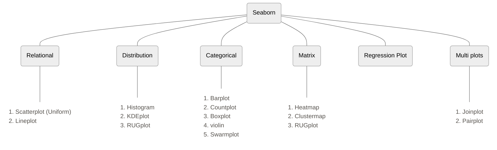

There are two types of functions in seaborn
1. Figure Level
2. Axis Level

The whole image generated by seaborn in divided into objects, the canvas on which the graph is plotted is called figure level, one canvas can contain multiple graphs, those graphs are axis level.
Same graph can be generated using figure level and axis level functions

Graphs are classified as follows:





```python
import seaborn as sns     #importing library
tips = sns.load_dataset('tips')     #importing dataset
```
# 1. Relational Plot

## Scatter plot

```python
# scatter plot -> axes level function

sns.scatterplot(data=tips, x='total_bill', y='tip', hue='sex', style='time', size='size')
```


```python
# relplot -> figure level -> square shape

sns.relplot(data=tips, x='total_bill', y='tip', kind='scatter', hue='sex', style='time', size='size')
```

![[Pasted image 20250622185406.png]]

## Line plot

```python
gap = px.data.gapminder()    #loading new data
temp_df = gap[gap['country'] == 'India']     #taking data of only india
```

```python
# axes level function

sns.lineplot(data=temp_df, x='year', y='lifeExp')
```

```python
# using relpplot

sns.relplot(data=temp_df, x='year', y='lifeExp', kind='line')
```

![[Pasted image 20250622185544.png]]


```python
temp_df = gap[gap['country'].isin(['India','Brazil','Germany'])]

sns.relplot(kind='line', data=temp_df, x='year', y='lifeExp', hue='country', style='continent', size='continent')

```

![[Pasted image 20250622185734.png]]

### Facet plots (multiple plots for some value)
- figure level function
- work with `relplot`
- it will not work with scatterplot and lineplot
If we want to plot multiple graphs based of a value, then we can only do it using figure level function because the multiple graphs are on same canvas, and only figure level function can access the canvas

```python
sns.relplot(data=tips, x='total_bill', y='tip', kind='line', col='sex', row='day')
```

![[Pasted image 20250622185900.png]]

- if the graphs are all in a row and difficult to see then we can wrap the columns using columns wrap

```python
sns.relplot(data=gap, x='lifeExp', y='gdpPercap', kind='scatter', col='year', col_wrap=3)
```

![[Pasted image 20250622185954.png]]


# 2. Distribution Plots

- Used for univariate analysis
- Used to find out the distribution
- Range of the observation
- Central Tendency
- Is the data bimodal?
- Are there outliers?

## Histplot

```python
# plotting univariate histogram

sns.histplot(data=tips, x='total_bill')
```

```python
sns.displot(data=tips, x='total_bill', kind='hist')
```

![[Pasted image 20250622190124.png]]


```python
# bins parameter

sns.displot(data=tips, x='total_bill', kind='hist',bins=2)
```

![[Pasted image 20250622190143.png]]


```python
# hue parameter

sns.displot(data=tips, x='tip', kind='hist',hue='sex')
```

![[Pasted image 20250622190214.png]]

```python
sns.displot(data=tips, x='tip', kind='hist', hue='sex', element='step')
```

![[Pasted image 20250622190233.png]]

```python
# faceting using col and row -> not work on histplot function

sns.displot(data=tips, x='tip', kind='hist',col='sex',element='step')
```

![[Pasted image 20250622190254.png]]

### Bivariate histogram

- A bivariate histogram bins the data within rectangles that tile the plot
- and then shows the count of observations within each rectangle with the fill color

```python
sns.displot(data=tips, x='total_bill', y='tip',kind='hist')
```

![[Pasted image 20250622190513.png]]


## KDE plot

Rather than using discrete bins, a KDE plot smooths the observations with a Gaussian kernel, producing a continuous density estimate

```python
sns.kdeplot(data=tips,x='total_bill')
```

```python
sns.displot(data=tips,x='total_bill',kind='kde')
```

![[Pasted image 20250622190346.png]]

```python
# hue -> fill

sns.displot(data=tips,x='total_bill', kind='kde', hue='sex', fill=True, height=10, aspect=2)
```

![[Pasted image 20250622190416.png]]

### Bivariate KDE plot

- A bivariate KDE plot smoothens the (x, y) observations with a 2D Gaussian

```python
sns.kdeplot(data=tips, x='total_bill', y='tip')
```

![[Pasted image 20250622190539.png]]

## RUG plot

- Plot marginal distributions by drawing ticks along the x and y axes.
- This function is intended to complement other plots by showing the location of individual observations in an unobtrusive way.

```python
sns.kdeplot(data=tips,x='total_bill')

sns.rugplot(data=tips,x='total_bill')
```

![[Pasted image 20250622190437.png]]


# 3. Matrix plot

## Heat Map
- Plot rectangular data as a color-encoded matrix

```python
temp_df = gap.pivot(index='country',columns='year',values='lifeExp')

# axes level function

plt.figure(figsize=(15,15))

sns.heatmap(temp_df)
```

![[Pasted image 20250622190606.png]]

```python
# annot

temp_df = gap[gap['continent'] == 'Europe'].pivot(index='country',columns='year',values='lifeExp')

#here we have changed the data from long data to wide data using pivot, need to learn more about this

plt.figure(figsize=(15,15))

sns.heatmap(temp_df,annot=True,linewidth=0.5, cmap='summer')
```

![[Pasted image 20250622190638.png]]

## Cluster Map
- Plot a matrix dataset as a hierarchically-clustered heatmap.
- This function requires `scipy` to be available.

```python
iris = px.data.iris()
sns.clustermap(iris.iloc[:,[0,1,2,3]])
```

![[Pasted image 20250622190744.png]]


