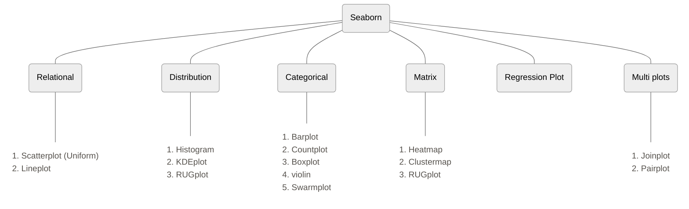
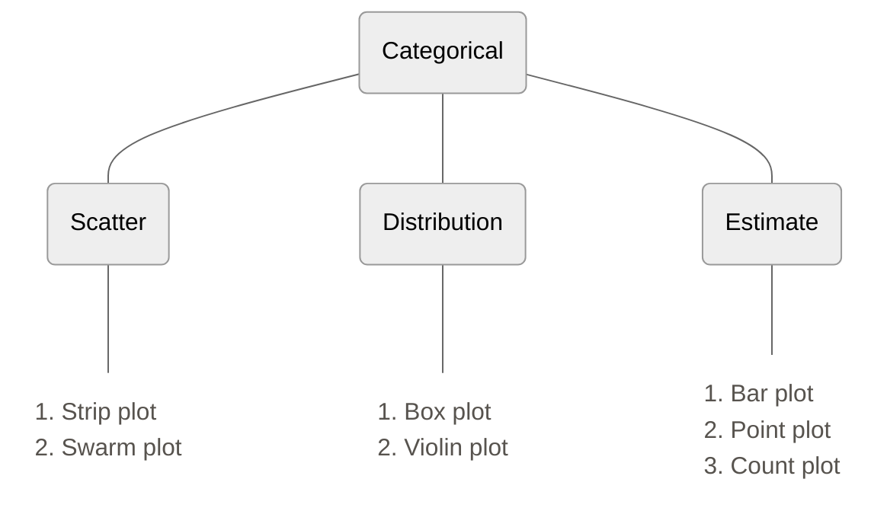

There are two types of functions in seaborn
1. Figure Level
2. Axis Level

The whole image generated by seaborn in divided into objects, the canvas on which the graph is plotted is called figure level, one canvas can contain multiple graphs, those graphs are axis level.
Same graph can be generated using figure level and axis level functions

Graphs are classified as follows:





```python
import seaborn as sns     #importing library
tips = sns.load_dataset('tips')     #importing dataset
sns.set_style("dark")
```
# 1. Relational Plot

## Scatter plot

```python
# scatter plot -> axes level function

sns.scatterplot(data=tips, x='total_bill', y='tip', hue='sex', style='time', size='size')
```


```python
# relplot -> figure level -> square shape

sns.relplot(data=tips, x='total_bill', y='tip', kind='scatter', hue='sex', style='time', size='size')
```

![[Pasted image 20250622185406.png]]

## Line plot

```python
gap = px.data.gapminder()    #loading new data
temp_df = gap[gap['country'] == 'India']     #taking data of only india
```

```python
# axes level function

sns.lineplot(data=temp_df, x='year', y='lifeExp')
```

```python
# using relpplot

sns.relplot(data=temp_df, x='year', y='lifeExp', kind='line')
```

![[Pasted image 20250622185544.png]]


```python
temp_df = gap[gap['country'].isin(['India','Brazil','Germany'])]

sns.relplot(kind='line', data=temp_df, x='year', y='lifeExp', hue='country', style='continent', size='continent')

```

![[Pasted image 20250622185734.png]]

### Facet plots (multiple plots for some value)
- figure level function
- work with `relplot`
- it will not work with scatterplot and lineplot
If we want to plot multiple graphs based of a value, then we can only do it using figure level function because the multiple graphs are on same canvas, and only figure level function can access the canvas

```python
sns.relplot(data=tips, x='total_bill', y='tip', kind='line', col='sex', row='day')
```

![[Pasted image 20250622185900.png]]

- if the graphs are all in a row and difficult to see then we can wrap the columns using columns wrap

```python
sns.relplot(data=gap, x='lifeExp', y='gdpPercap', kind='scatter', col='year', col_wrap=3)
```

![[Pasted image 20250622185954.png]]


# 2. Distribution Plots

- Used for univariate analysis
- Used to find out the distribution
- Range of the observation
- Central Tendency
- Is the data bimodal?
- Are there outliers?

## Histplot

```python
# plotting univariate histogram

sns.histplot(data=tips, x='total_bill')
```

```python
sns.displot(data=tips, x='total_bill', kind='hist')
```

![[Pasted image 20250622190124.png]]


```python
# bins parameter

sns.displot(data=tips, x='total_bill', kind='hist',bins=2)
```

![[Pasted image 20250622190143.png]]


```python
# hue parameter

sns.displot(data=tips, x='tip', kind='hist',hue='sex')
```

![[Pasted image 20250622190214.png]]

```python
sns.displot(data=tips, x='tip', kind='hist', hue='sex', element='step')
```

![[Pasted image 20250622190233.png]]

```python
# faceting using col and row -> not work on histplot function

sns.displot(data=tips, x='tip', kind='hist',col='sex',element='step')
```

![[Pasted image 20250622190254.png]]

### Bivariate histogram

- A bivariate histogram bins the data within rectangles that tile the plot
- and then shows the count of observations within each rectangle with the fill color

```python
sns.displot(data=tips, x='total_bill', y='tip',kind='hist')
```

![[Pasted image 20250622190513.png]]


## KDE plot

Rather than using discrete bins, a KDE plot smooths the observations with a Gaussian kernel, producing a continuous density estimate

```python
sns.kdeplot(data=tips,x='total_bill')
```

```python
sns.displot(data=tips,x='total_bill',kind='kde')
```

![[Pasted image 20250622190346.png]]

```python
# hue -> fill

sns.displot(data=tips,x='total_bill', kind='kde', hue='sex', fill=True, height=10, aspect=2)
```

![[Pasted image 20250622190416.png]]

### Bivariate KDE plot

- A bivariate KDE plot smoothens the (x, y) observations with a 2D Gaussian

```python
sns.kdeplot(data=tips, x='total_bill', y='tip')
```

![[Pasted image 20250622190539.png]]

## RUG plot

- Plot marginal distributions by drawing ticks along the x and y axes.
- This function is intended to complement other plots by showing the location of individual observations in an unobtrusive way.

```python
sns.kdeplot(data=tips,x='total_bill')

sns.rugplot(data=tips,x='total_bill')
```

![[Pasted image 20250622190437.png]]


# 3. Matrix plot

## Heat Map
- Plot rectangular data as a color-encoded matrix

```python
temp_df = gap.pivot(index='country',columns='year',values='lifeExp')

# axes level function

plt.figure(figsize=(15,15))

sns.heatmap(temp_df)
```

![[Pasted image 20250622190606.png]]

```python
# annot

temp_df = gap[gap['continent'] == 'Europe'].pivot(index='country',columns='year',values='lifeExp')

#here we have changed the data from long data to wide data using pivot, need to learn more about this

plt.figure(figsize=(15,15))

sns.heatmap(temp_df,annot=True,linewidth=0.5, cmap='summer')
```

![[Pasted image 20250622190638.png]]

## Cluster Map
- Plot a matrix dataset as a hierarchically-clustered heatmap.
- This function requires `scipy` to be available.

```python
iris = px.data.iris()
sns.clustermap(iris.iloc[:,[0,1,2,3]])
```

![[Pasted image 20250622190744.png]]

# 4. Categorical Plots
We use these plots for categorical variables


## Categorical Scatterplot
	
- This gives us a bivariate analysis
- Used for plotting categorical variables
- Figure level function -> `catplot`

### Strip Plot

```python
# axes level function

sns.stripplot(data=tips,x='day',y='total_bill')
```

```python
# figure level function

sns.catplot(data=tips, x='day',y='total_bill',kind='strip')
```

![[Pasted image 20250622222153.png]]

This width of each columns is introduced by `sns` to improve visibility i.e. some random noise is added to each column, this is called jitter.

```python
# jitter

sns.catplot(data=tips, x='day',y='total_bill',kind='strip',jitter=0.2,hue='sex')
```

![[Pasted image 20250622222238.png]]

### Swarm Plot

This is similar to scatter plot with one advantage being that we get a better idea of distribution of data along the column

```python
sns.catplot(data=tips, x='day',y='total_bill',kind='swarm')
```

![[Pasted image 20250622222259.png]]


```python
# hue

sns.swarmplot(data=tips, x='day',y='total_bill',hue='sex')
```

![[Pasted image 20250622222337.png]]

## Categorical Distribution plot
### Boxplot

A boxplot is a standardized way of displaying the distribution of data based on a five number summary (“minimum”, first quartile [Q1], median, third quartile [Q3] and “maximum”). It can tell you about your outliers and what their values are. Boxplots can also tell you if your data is symmetrical, how tightly your data is grouped and if and how your data is skewed.

![[Pasted image 20250622200729.png]]


```python
sns.boxplot(data=tips,x='day',y='total_bill')
```

```python
# Using catplot

sns.catplot(data=tips,x='day',y='total_bill',kind='box')
```

![[Pasted image 20250622222359.png]]


```python
# hue

sns.boxplot(data=tips,x='day',y='total_bill',hue='sex')
```

![[Pasted image 20250622222444.png]]


```python
# single boxplot -> numerical col

sns.boxplot(data=tips,y='total_bill')
```

![[Pasted image 20250622222500.png]]

### Violinplot = (Boxplot + KDEplot)

```python
sns.violinplot(data=tips,x='day',y='total_bill')
```

```python
sns.catplot(data=tips,x='day',y='total_bill',kind='violin')
```

![[Pasted image 20250622222525.png]]


```python
# hue

sns.catplot(data=tips,x='day',y='total_bill',kind='violin',hue='sex',split=True)
```

![[Pasted image 20250622222628.png]]

## Categorical Estimation plot
### Bar Plot

```python
import numpy as np

sns.barplot(data=tips, x='sex', y='total_bill',hue='smoker',estimator=np.min)
```

When there are multiple observations in each category, it also uses bootstrapping to compute a confidence interval around the estimate, which is plotted using error bars

![[Pasted image 20250622222649.png]]


```python
sns.barplot(data=tips, x='sex', y='total_bill',errorbar=None)
```

![[Pasted image 20250622222708.png]]

### Point Plot

```python
sns.pointplot(data=tips, x='sex', y='total_bill',hue='smoker',errorbar=None)
```

![[Pasted image 20250622222853.png]]


### Count Plot

```python
sns.countplot(data=tips,x='sex',hue='day')
```

![[Pasted image 20250622222947.png]]

A special case for the bar plot is when you want to show the number of observations in each category rather than computing a statistic for a second variable. This is similar to a histogram over a categorical, rather than quantitative, variable

```python
# faceting using catplot

sns.catplot(data=tips, x='sex',y='total_bill',col='smoker',kind='box',row='time')
```

![[Pasted image 20250622223051.png]]

# 5. Regression Plots

- regplot
- lmplot

In the simplest invocation, both functions draw a scatterplot of two variables, x and y, and then fit the regression model y ~ x and plot the resulting regression line and a 95% confidence interval for that regression.

```python
# axes level

# hue parameter is not available

sns.regplot(data=tips,x='total_bill',y='tip')
```

![[Pasted image 20250622223126.png]]


```python
#lmplot: exactly same as regplot but with hue param

sns.lmplot(data=tips,x='total_bill',y='tip',hue='sex')
```

![[Pasted image 20250622223143.png]]

```python
# residplot: plot of error in prediction using regression, doted line represent 0 error

sns.residplot(data=tips,x='total_bill',y='tip')
```

![[Pasted image 20250622223204.png]]

# 6. Multigrid Plots

## Facet Grid

- A second way to plot Facet plots -> Facet Grid

```python
g = sns.FacetGrid(data=tips,col='day',row='time',hue='smoker')

g.map(sns.boxplot,'sex','total_bill')

g.add_legend()
```

![[Pasted image 20250622223258.png]]

## Pair Plot

- Plotting Pairwise Relationship (PairGrid Vs Pairplot)

```python
# pairplot

sns.pairplot(iris,hue='species')

# plots a scatterplot between all pairs of coulmns and histogram/kde for diagonals
```

![[Pasted image 20250622223404.png]]

```python
# pair grid

g = sns.PairGrid(data=iris,hue='species')

# g.map

g.map(sns.scatterplot)
```

![[Pasted image 20250622223421.png]]

```python
# map_diag -> map_offdiag

g = sns.PairGrid(data=iris,hue='species')

g.map_diag(sns.boxplot)

g.map_offdiag(sns.kdeplot)
```

![[Pasted image 20250622223438.png]]

```python
# map_diag -> map_upper -> map_lower

g = sns.PairGrid(data=iris,hue='species')

g.map_diag(sns.histplot)

g.map_upper(sns.kdeplot)

g.map_lower(sns.scatterplot)
```


![[Pasted image 20250622223459.png]]

```python
# vars

g = sns.PairGrid(data=iris,hue='species',vars=['sepal_width','petal_width'])

g.map_diag(sns.histplot)

g.map_upper(sns.kdeplot)

g.map_lower(sns.scatterplot)
```

![[Pasted image 20250622223517.png]]

# JointGrid Vs Jointplot

- Used to study 2D and 1D together

```python
sns.jointplot(data=tips,x='total_bill',y='tip',kind='hist',hue='sex')
```

![[Pasted image 20250622223542.png]]

```python
g = sns.JointGrid(data=tips,x='total_bill',y='tip')

g.plot(sns.kdeplot,sns.violinplot)
```

![[Pasted image 20250622223600.png]]


### Utility Functions

```python
# get dataset names

sns.get_dataset_names()
```

```python
# load dataset

sns.load_dataset('planets')

```