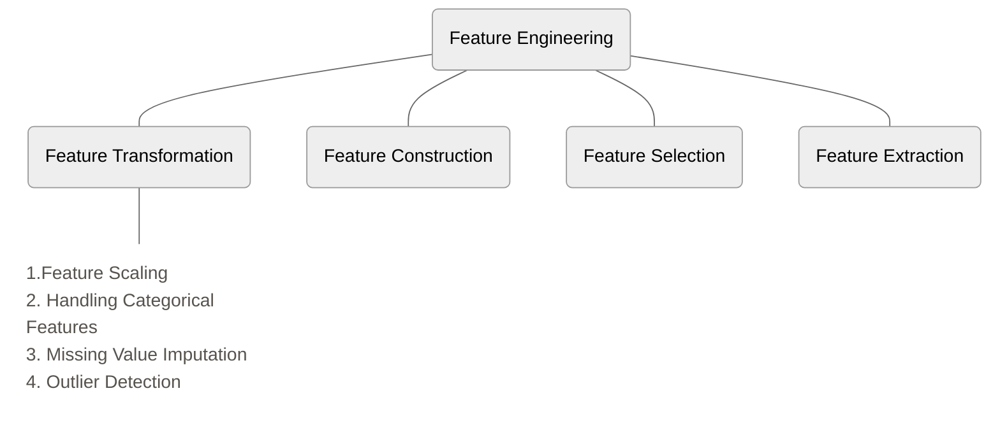
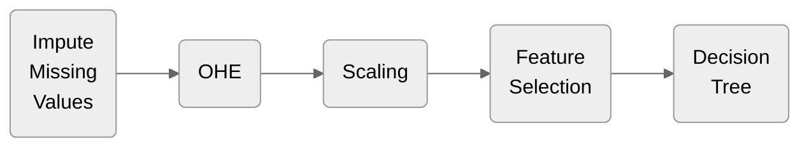
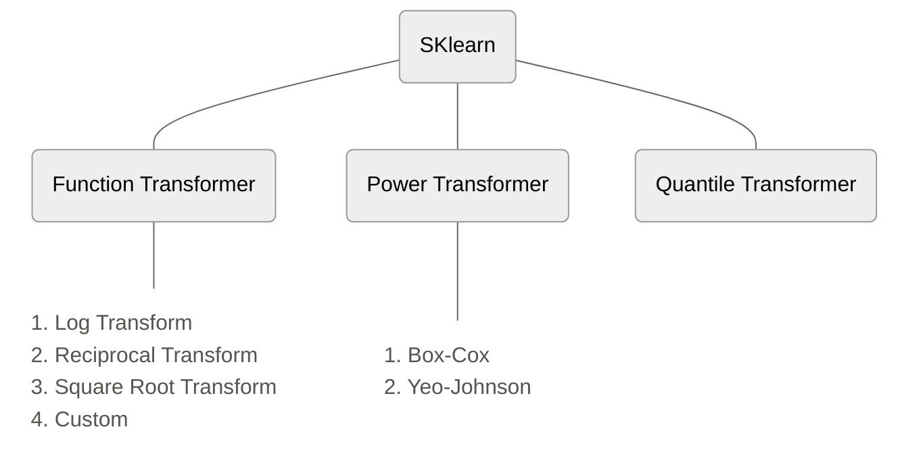
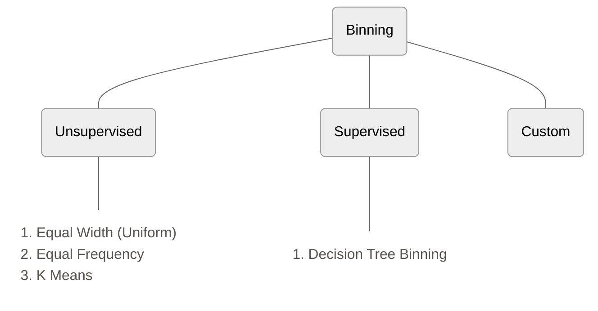
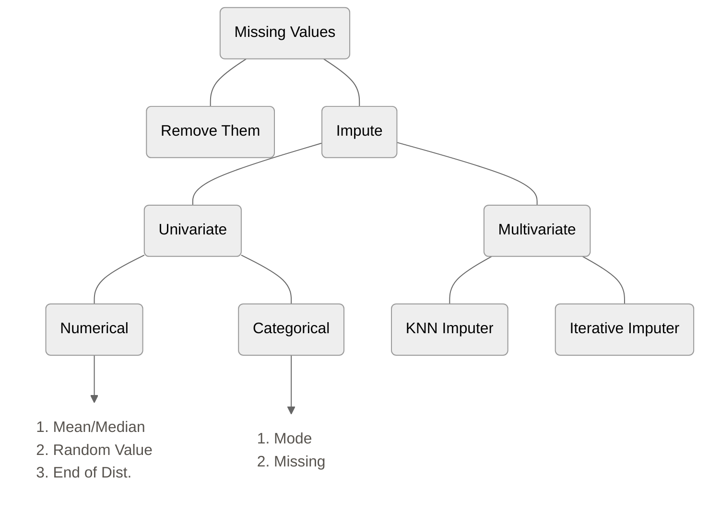
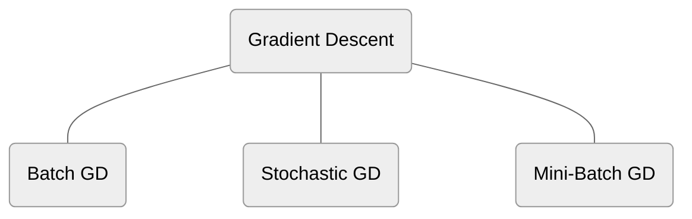
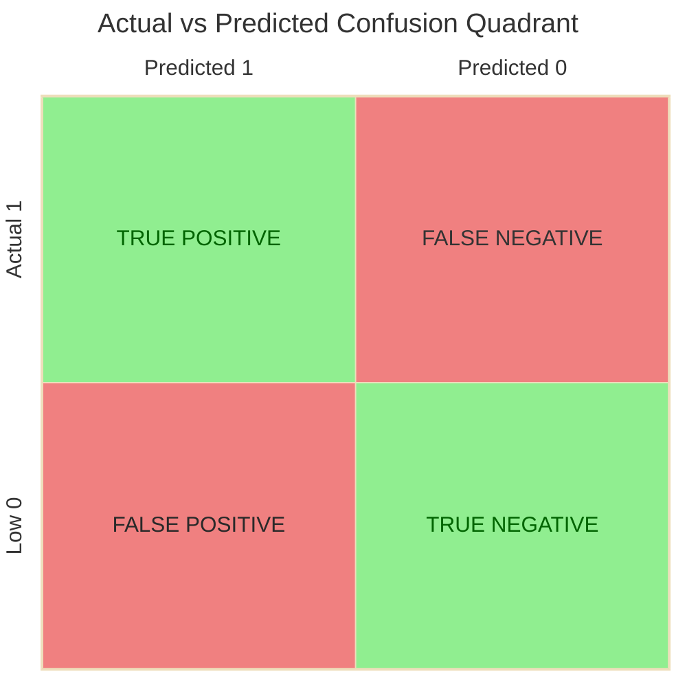

# Libraries

```python
import numpy as np
import pandas as pd
import matplotlib.pyplot as plt
import seaborn as sns
```

# Basic lines Of Code


```python
df = pd.read_csv('/content/sample_data/california_housing_train.csv') # Importing dataset
```

```python
df = pd.read_csv('/content/sample_data/california_housing_train.csv')[['longitude','latitude','total_rooms','population']] # Importing selected columns
```

```python
df.head() # Returns first 5 rows
```

```python
df.tail() # Returns last 5 rows
```

```python
df.sample(5) # Returns 5 random rows
```

```python
df.shape # Returns (rows, columns)
```

```python
df.info() # Returns datatype and no. of notnull values in each column
```

```python
df['column_name'].value_counts() # Returns frequency of each category in that column
```

```python
df.isnull().sum() # Which columns has how many missing values
```

```python
df.duplicated().sum() # Check duplicated data
```

```python
df.drop(columns=['column_1','column_2'],inplace=True) # Remove selected columns
```

```python
x = df.iloc[:,0:2] # x = all rows, column from 0 to 1 (2 excluded)
```

```python
y = df.iloc[:,-1] # y = all rows, the 1 column from last)
```

```python
# Train Test Split(done after difining x and y)
from sklearn.model_selection import train_test_split
train_test_split(x,y,test_size=0.1) #10% rows will be in test
# we will get 4 things from this
    #1.xtrain
    #2.xtest
    #3.ytrain
    #4.ytest
#we can store these in a variable while generating using the following single command'''
x_train,x_test,y_train,y_test = train_test_split(x,y,test_size=0.1)
```


```python
#Getting data from kaggle to google colab without downloading
from google.colab import drive
drive.mount('/content/drive')
!mkdir ~/.kaggle
! cp /content/drive/MyDrive/Kaggle_API/kaggle.json ~/.kaggle/
! chmod 600 ~/.kaggle/kaggle.json
```


```python
#copy the code to download dataset from kaggle
!kaggle competitions download -c spaceship-titanic
!unzip spaceship-titanic.zip
```


---


How to calculate accuracy score ?
```python
from sklearn.metrics import accuracy score
y_pred = clf.predict(X_test) # clf is our model
accuracy_score(y_test,y_pred)
```

# Working with Data (15-18)

1. CSV
	- Comma Separated Values
	- Tabs Separated Values
2.  JSON/SQL 
3. API
4. Web Scraping

# Understanding Data (19-22)

What are the basic questions you should ask when you get new data

1. How big is the data ?
	- `df.shape`
2. How does the data look like ?
	- `df.sample(5)`
3. What is the data type of cols ?
	- `df.info`
4. Are there any missing values ?
	- `df.isnull().sum()`
5. How does the data look mathematically ?
	- `df.describe()`
6. Are there duplicate values ?
	- `df.duplicated().sum()`
7. How is the correlation between cols ?
	- Some input columns don't have any affect on output columns, so we want to remove them
	- `df.corr()`
	- This tells us Pearson's correlation between columns

## EDA (20-21)

purpose is to understand data fully

### Univariate Analysis (20)
Each column can be considered as a variable, so analyzing a column independently is univariate analysis
prerequisites: [[Seaborn]], [[Matplotlib]]


### Bivariate Analysis (21)
## Pandas Profiling (22)

This library  automates the above task

```python
from pandas_profiling import ProfileReport
prof = ProfileReport(df)
prof.to_file(output_file='output.html')
```

This will generate a file in the current directory that includes all the graphs and reports
# Feature Engineering (23-47)

*  Feature engineering is the process of using domain knowledge to extract features from raw data
*  sab apna alag tareke se karte h, achi feature engineering karenge to model bhot acha chalega



## Feature Scaling (24-25)

Feature scaling is a technique used to standardize the independent features in the data within a fixed range. Let's say one column has a range of **0-10,000** and another column has a range of **0-10**. In some algorithms (e.g., **KNN**), the first column will dominate, leading to poor results.  
Therefore, **feature scaling** is important.

### Types of Feature Scaling:

1. Standardization (Z-score Normalization)
2. Normalization

### 1. Standardization (Z-score Normalization)

The formula for standardization:

$$
X'_i = \frac{X_i - \bar X}{\sigma}
$$

Where:
	- X̄ is the mean of the feature
	- σ is the standard deviation

[demo code](https://colab.research.google.com/drive/1E_SwE1_8s0gz9OPfWtE_Bi7L3AzO3d1w#scrollTo=RRUGN6li_yaz)
	- Whenever we want to do feature scaling, it is recommended to split the train-test data first.
	- After transformation, the output is in a 2D array**. To convert it into a DataFrame, it
	- It is important to write the appropriate code.
	- It is important to provide <strong>scaled data</strong> to Logistic Regression.
	- Almost never do we face any disadvantages after scaling.
	- After scaling, the **distribution remains the same**; only the scale changes.

#### When to Use Standardization:

- **K-Means**
- **KNN (K-Nearest Neighbors)**
- **PCA (Principal Component Analysis)**
- **Artificial Neural Networks**
- **Gradient Descent** (Linear Regression, Logistic Regression)

### 2. Normalization (25)

The goal of <strong>Normalization</strong> is to change the values of numerical columns in a dataset to use a common scale, without distorting differences in the ranges of values or losing information.

#### Types of Normalization:

- **Min-Max Scaling** (default)
- **Mean Normalization**
- **Max Absolute Scaling**
- **Robust Scaling**
- There are more normalization techniques available in ``sklearn``.

#### 2.1 Min-Max Scaling Formula:

$$
X'_i = \frac{X_i - X_{min}}{X_{max} - X_{min}}
$$

[code demo](https://colab.research.google.com/drive/1ctE9PPkGdt7yvRDNcvBN9u1RTiHoXImo#scrollTo=G1Cbr8so8YtX)

#### 2.3 Max Absolute Scaling (Not Used Much)

Used when we have <strong>sparse data</strong>, meaning there are a lot of zeroes in the dataset.
##### Formula:

$$
X'_i = \frac{X_i}{\vert X_{max}\vert}
$$

#### 2.4 Robust Scaling (Sometimes Used)

If there are a lot of <strong>outliers</strong> in the data, this might perform well.
##### Formula:

$$
X^{'}_i = \frac{X_i - X_{median}}{IQR}
$$

**IQR** = 75th percentile - 25th percentile

### Normalization vs Standardization

- **Is feature scaling required?**
	-Algo kese kaam karti h pta hona chahie.
- **Mostly, we get better results in standardization.**

# Encoding Categorical Data (26-27)

## Types of Categorical Data

- **Ordinal Categorical Data:** There is a relationship between categories.
	-*Example*: Exam grades (A > B > C)
- **Nominal Categorical Data:** No relationship between categories.
	-*Example*: Cannot decide an order between Male and Female.

## 1. Ordinal Categorical Data

- We assign numbers to each category.
- There are two classes in <code>sklearn</code> for this:
	- **OrdinalEncoder:** Used for <code>X</code>.
	- **LabelEncoder:** Used for <code>Y</code>.
- Both perform the same function.

[demo code](https://colab.research.google.com/drive/17sSlg6qG5eWukBt3K_zrwPXAPftT2q-m#scrollTo=_IZSt3M6LQ1u)

## 2. Nominal Categorical Data

- We use **One-Hot Encoding** to handle this.
- Each category gets its own column.
- **Dummy Variable Trap:**
	- If we have <code>n</code> categories, we should create <code>n</code> columns.
	- However, we can manage with <code>n-1</code> columns because when all <code>n-1</code> columns are <code>0</code>, we can derive that the last column will be <code>1</code>.
- If our columns are dependent on each other, it creates a problem called **Multi-Collinearity** in many models.
- To handle this, we remove that one column.
- If we have <code>40</code> categories:
	- Instead of making <code>40</code> new columns, we assign separate columns to categories with higher frequencies.
	- Categories that occur less frequently are grouped into a single column.

[code demo](https://colab.research.google.com/drive/1V0zQ9tE2TgqB45q9XU1SPkP7ygcdiRWz#scrollTo=EOCf-jxKQZDk)  need to watch again

# Column Transformer (28)

- Each column has different problems:
	- Some have missing data.
	- Some have nominal data.
	- Some have categorical data.
- Applying suitable operations to each column individually and then combining them takes a lot of effort.
- To simplify this process, we use **Column Transformer**.

[code demo](https://colab.research.google.com/drive/1cs7H9ioppThhCUOvDx0onPlSFgOQ8Q-W#scrollTo=_dpXCEjXziVq)

# Pipelines (29)

- Pipelines chain together multiple steps so that the output of each step is used as input to the next step.
- Pipelines make it easy to apply the same preprocessing to both train and test data.

## Case 1: Project Without Pipeline

We make a project without using a pipeline.  
	📌 <a href="https://colab.research.google.com/drive/1AXf1zpt3FLmLM4Y7VXdwcnpcM6d2g8mj#scrollTo=98PISBlp49rx" target="_blank" style="color: #4ea1d3;">View Code</a>

Then we deploy it.  
	📌 <a href="https://colab.research.google.com/drive/1Kw35z4WJJ7JhHLRZZ1AQG4C0qR0fUU8B#scrollTo=iG1n9k0558Gz" target="_blank" style="color: #4ea1d3;">View Code</a>

## Case 2: Same Project Using Pipeline




- Made project using pipeline
	📌 <a href="https://colab.research.google.com/drive/1IYYnn-KKZo8gbAXGAAkNmGg8nJoJA57C#scrollTo=inB4egDM7WYw" target="_blank" style="color: #4ea1d3;">View Code</a>
 - Then we deploy it.  
	 📌 <a href="https://colab.research.google.com/drive/1vWnOkmYbFQuO-Dlb0eXRNzwUtawbpn_8#scrollTo=glyxfEGb_Tu0" target="_blank" style="color: #4ea1d3;">View Code</a>

# Mathematical Transformers (30-)

- For many algorithms, we want our data to be in a **normal distribution**.
- If the data is not normally distributed, we use **mathematical transformations** to make it normal.




## 🔍 How to find if data is "Normal" or not?

* Use <code style="color: #ffcc00;">sns.distplot</code> from sklearn and see
* Use <code style="color: #ffcc00;">pd.skew()</code>  from pandas, if it gives 0 then its normal distributed
* QQ plot (most reliable method)(stats topic)

## Function Transformer
### 1. Log Transform

* Just take log of each values of a column
* Cant use in negative values
* Best use case: Right skewed data gets centered(normal)
  
### 2. Reciprocal Transform

* Take reciprocal of each value in a column
  
### 3. Square Transform

* Best use case: left skewed data
  
### 4. Square Root Transform

*  rarely used
  
[demo code](https://colab.research.google.com/drive/1vdl__GyX5MbIRrBtqsQjo0HwMFvAL-OW#scrollTo=Kv1eLu-TM2lp)

## Power Transformer(31)

### 1. Box-Cox Transform

$$
x_i^{(\lambda)} =
\begin{cases}
\frac{x_i^{\lambda} - 1}{\lambda}, & \text{if } \lambda \neq 0, \\[10pt]
\ln(x_i), & \text{if } \lambda = 0.
\end{cases}
$$

* The exponent here is a variable called lambda that varies over the range of -5 to 5, and in the process of searching, we examine all values of lambda. Finally, we choose the optimal value (resulting in the best approximation to a normal distribution) for your valiable
* to learn more study:
	maximum likelihood
	bayesian stats
* data shouldn't be negative or zero

### 2. Yeo-Johnson Transform

$$
x_i^{(\lambda)} =
\begin{cases}
\frac{(x_i + 1)^{\lambda} - 1}{\lambda}, & \text{if } \lambda \neq 0, x \geq 0 \\[10pt]
\ln(x_i + 1), & \text{if } \lambda = 0, x \geq 0 \\[10pt]
-\frac{((-x_i + 1)^{(2 - \lambda)} - 1)}{(2 - \lambda)}, & \text{if } \lambda \neq 2, x < 0 \\[10pt]
-\ln(-x_i + 1), & \text{if } \lambda = 2, x < 0
\end{cases}
$$

* This transformation is somewhat of an adjustment to the Box-Cox transformation, by which we can apply it to negative numbers
[code demo](https://colab.research.google.com/drive/1u50RDAecCZhXoHP0J-Mla-EbilBBZxrX#scrollTo=Cul6x7kSRoRR)

# Encoding Numerical Data (32)

If we want to convert numerical data into categorical, we use
1. Binning(Discretization)
2. Binarization

## 1. Binning

We create bins for different range of values,
It can be used to
*   Handle outliers
*   Improve the value spread



### 1.1. Equal Width(uniform) Binning

  * we tell the number of bins
  * then this formula is applied

$$
\frac{max\_val - min\_val}{\text{no. of bins}}
$$


### 1.2. Equal Frequency/Quantile Binning

  *  We tell the number of bins
  *  We divide bins according to percentile
  *  Used in most cases

### 1.3. KMeans binning

[demo code](https://colab.research.google.com/drive/15mCBqPV7wgGfeNQeHYa1DmjQvWsmWJPO#scrollTo=3Jjj3eTIZBTm)

## 2. Binarization

[demo code](https://colab.research.google.com/drive/1AKkTpaMnsZV4Yl62FI_pflMwoTOCNvRe#scrollTo=7D2OxbpaZ34q)

# Handling Mixed Variables (33)

### Case 1:

$$
\begin{array}{c c c c c}
\begin{array}{|c|}
\hline
\textbf{Cabin} \\
\hline
B5  \\
\hline
C23 \\
\hline
D41 \\
\hline
B12 \\
\hline
\end{array}
& \quad \Rightarrow \quad &
\begin{array}{|c|c|}
\hline
\textbf{} & \textbf{} \\
\hline
B & 5 \\
\hline
C & 23 \\
\hline
D & 41 \\
\hline
B & 12 \\
\hline
\end{array}
\end{array}
$$

### Case 2:

$$
\begin{array}{c c c c c}
\begin{array}{|c|}
\hline
   \\
\hline
7  \\
\hline
3  \\
\hline
1  \\
\hline
A  \\
\hline
C  \\
\hline
4  \\
\hline
\end{array}
& \quad \Rightarrow \quad &
\begin{array}{|c|c|}
\hline
\textbf{} & \textbf{} \\
\hline
7 & NA \\
\hline
3 & NA \\
\hline
1 & NA \\
\hline
NA & A \\
\hline
NA & C \\
\hline
4 & NA \\
\hline
\end{array}
\end{array}
$$

[demo code](https://colab.research.google.com/drive/171LWX1G6eCau3KxVM1Awu1ScmT2_RWY9#scrollTo=MBnO9MCUhKc_)

# Handling Date and Time Variables (34)

# Handling Missing Data (35-39)





## Complete-Case-Analysis (CCA)(35)

Complete-Case-Analysis (CCA), also called "list-wise deletion" of cases, consist of discarding rows where values in any of the columns are missing
CCA means literally analyzing only those observations for which there is information in all of the variables in the dataset

**Assumption**: Data is missing completely at random

**Advantage**:
  1. Easy to implement as no data manipulation required
  2. Preserves variable distribution (if data is MCAR)

**Disadvantages**:
  1. It can exclude a large fraction of the original dataset
  2. Excluded observations could be informative for the analysis(If data is not MCAR)
  3. When using our model in production, the model will not know how to handle missing data

**When to use CCA:**
  1. Data is MCAR
  2. less than 5% data is missing
  
[demo code](https://colab.research.google.com/drive/1actpRsCIOJMTJ_rFBjxF9LlOcbrJHMp2#scrollTo=fPJFIk9bpaSA)


## Univariate Numerical (36)

### 1. Mean/Median:

  **Advantages:**
  1. Simple and easy to use

  **Disadvantage:**
  2. Changes distribution shape
  3. Creates outliers
  4. Covariance/Correlation changes
    
  **When to use:**
  5. MCAR
  6. 5% < missing

[demo code](https://colab.research.google.com/drive/1LxDKB3qg0jHH-lbXxqaiBEhCgcMBgoML#scrollTo=fDv0--X7LVYp)

### 2. Arbitrary Value Imputation:

Choose some value that is not present in our data, and put that in place of all missing data in column

  **Advantage:**
  1. Easy to apply

  **Disadvantage:**
  2. Changes distribution shape
  3. Covariance/Correlation changes

  **When to use:**
  4. Not used much in numerical data

[demo code](https://colab.research.google.com/drive/1pBmDAL5Xm3G2N_8-zWUFIRJMqjvvg-EK#scrollTo=9aiTrrICL1Jl)

### 3. End of distribution Imputation:

Instead of some random value we replace missing values with outliers(watch video again for more)

**when to use:**
  1. when data is not missing at random

## Univariate Categorical(37)

### 1. Mode:

Replace missing values with most frequent category

  **Assumption:** MCAR

  **Advantage:** Easy

  **Disadvantage:** Changes Distribution of data

  **When to use:** mode and "second mode" have substantial difference

[demo code](https://colab.research.google.com/drive/1Hj75YFApBgCl-poAIFDQ5RPFF0o9AH9k#scrollTo=ZYYbBW5MNiA9)

### 2. Missing Category Imputation:

We create a new category for missing values called "missing"

[demo code](https://colab.research.google.com/drive/1jlhq9MNcvN83pxvXzcgq5tdCsOVG9YMR#scrollTo=TC7Peq_1OIau)

Video 38 skipped
## KNN Imputer(39)
## Iterative Imputer(40)

# Outliers in Machine Learning (41-44)

## 🛠️ How to Treat Outliers?

- **Trimming:** Delete the outliers.
- **Capping:** Put limits on values, e.g., anything above <code style="color: #ffcc00;">90</code> is set to <code style="color: #ffcc00;">90</code> and anything below <code style="color: #ffcc00;">1</code> is set to <code style="color: #ffcc00;">1</code>.
- **Treat as Missing Value:** Handle outliers as missing data.
- **Binning:** Make bins of data, grouping high outliers into one bin and low outliers into another.

## 🔍 How to Identify Outliers?

- **Normally Distributed Data:** Outliers lie outside <code style="color: #ffcc00;">mean ± (3 × standard deviation)</code>.
- **Skewed Data:** Use the <code style="color: #ff6666;">boxplot</code> definition of outliers (1.5 × IQR rule).
- **General Approach (Percentile-Based):** Values beyond the <code style="color: #66ff99;">97.5th percentile</code> or below the <code style="color: #66ff99;">2.5th percentile</code> are considered outliers.

## Technique for Outlier Detection and Removal

1. **Z-Score**
2. **IQR-Based Filtering**
3. **Percentile**

## 1. Z-Score

- Only on normal distribution

```python
df.sample(5)
```

<p style="color: #dcdcdc; font-size: 16px; font-family: Arial, sans-serif; line-height: 1.6;">
    We find the distribution of each column.  
    For those columns whose distribution is normal, we find the mean and standard deviation.
</p>

```python
sns.displot(df['longitude'])
sns.displot(df['latitude'])
sns.displot(df['housing_median_age'])
sns.displot(df['total_rooms'])
sns.displot(df['total_bedrooms'])
sns.displot(df['population'])
sns.displot(df['households'])
sns.displot(df['median_income'])
sns.displot(df['median_house_value'])
plt.show()
```

<p style="color: #dcdcdc; font-size: 16px; font-family: Arial, sans-serif; line-height: 1.6;">
    Median income looks like a normal curve, so...
</p>

```python
print("Mean value of cgpa",df['median_income'].mean())
print("Std value of cgpa",df['median_income'].std())
print("Min value of cgpa",df['median_income'].min())
print("Max value of cgpa",df['median_income'].max())
print("Highest allowed",df['median_income'].mean()+ 3*df['median_income'].std())
print("Lowest allowed",df['median_income'].mean()- 3*df['median_income'].std())
df[(df['median_income'] > 9.60) | (df['median_income'] < -1.84)]
```
<p style="color: #dcdcdc; font-size: 16px; font-family: Arial, sans-serif; line-height: 1.6;">
    Now we can do either trimming or capping.
</p>

### Trimming

```python
new_df = df[(df['median_income'] < 9.60) & (df['median_income'] > -1.84)]
```

### Capping

```python
upper_limit = df['median_income'].mean() + 3*df['median_income'].std()
lower_limit = df['median_income'].mean() - 3*df['median_income'].std()
df['median_income'] = np.where(df['median_income']>upper_limit,upper_limit,np.where(df['median_income']<lower_limit,lower_limit,df['median_income']))
sns.displot(new_df['median_income'])
```

![image.png](data:image/png;base64,iVBORw0KGgoAAAANSUhEUgAAAeoAAAHpCAIAAADCm+jDAAAgAElEQVR4Ae2dC3BUVZ7/bxLzDnmRQIDQAZWXZkQoYBFTMBKMPFwwlMCCjDwsrADy+BcIMk4qllSQGVgcZ13YWOPC8pfKrLA8FqflYVAGAYEMCaBAAgQwIg8XkiZgkiLk/Ge4/9y99D1JTvrc0/fc298uCk7/7vn9zu98f+d8+nL7drdC8IACUAAKQAEbKqDYMGekDAWgABSAAgT4xiKAAlAACthSAeDblmVD0lAACkAB4BtrAApAAShgSwWAb1uWDUlDASgABYBvrAEoAAWggC0VAL5tWTYkDQWgABRwAr4bGxs9Hk9jYyPKCQWgABQIHAWcgG+Px6MoisfjCZyyYaZQAApAAeAbawAKQAEoYEsFgG9blg1JQwEoAAWAb6wBKAAFoIAtFQC+bVk2JA0FoAAUAL6xBqAAFIACtlQA+LZl2ZA0FIACUAD4xhqAAlAACthSAeDblmVD0lAACkAB4BtrAApAAShgSwWAb1uWDUlDASgABYBvrAEoAAWggC0VAL5tWTYkDQWgABQAvrEGoAAUgAK2VAD4tmXZkDQUgAJQAPjGGoACUAAK2FIB4NuWZUPSUAAKQAHgG2sACkABKGBLBYBvW5YNSUMBKAAFgG+sASgABaCALRUAvm1ZNkuSHpM9oX/GcK8/Y7InWJIMBoUCUAD4xhpgVaB/xvBJBYe8/vTPGM7qj35QAAqYqgDwbaqcjg4GfDu6vJic/RQAvu1XM6syBr6tUh7jQgGqAmLx3dDQ8Jvf/KZbt24RERGPPvrou+++29jYqObR2NiYm5ubkpISERGRmZlZXl6u5Xfz5s0pU6a0a9cuLi5u5syZNTU12iFqw+PxKIri8XioR2E0SwHg2ywlEQcKmKKAWHzn5+e3b9/+s88+u3jx4ubNm2NiYj744AM175UrV8bFxW3fvv3EiRNjx47t3r17bW2temjkyJF9+/b95ptvDhw48Pjjj0+ePLnlqQLfLetj1lHg2ywlEQcKmKKAWHyPGTNm5syZWqLjx49/5ZVXCCGNjY0pKSmrVq1SD1VXV4eHhxcWFhJCTp8+rSjKsWPH1EOff/55UFDQlStXtCDGBvBt1ESEBfgWoSpiQgGfFRCL7/z8/LS0tLKyMkJIaWlphw4dPvnkE0LIhQsXFEUpKSnR8h46dOj8+fMJIR9//HF8fLxmv3fvXkhIyNatWzWL2qirq/M0PSorK3HxxEsfEU+BbxGqIiYU8FkBsfi+f//+0qVLg4KCHnnkkaCgoBUrVqiJHjx4UFGUH3/8Uct7woQJEydOJITk5+f37NlTsxNCkpOT165dq7f8rZ2Xl6c8/MC1by+JTH8KfJsuKQJCAR4FxOK7sLAwNTW1sLDw5MmTGzduTExM3LBhAyGEH984++apum++wLdvusELCghSQCy+U1NTP/zwQy315cuX9+rVy5SLJ1pMQgiufevVENcGvsVpi8hQwAcFxOI7MTFRf91jxYoVPXr00N66XL16tZqxx+PxeuuyuLhYPbR79268delDXUW4AN8iVEVMKOCzAmLxPW3atC5duqg3Dm7dujUpKWnJkiVqritXroyPj9+xY8fJkyfHjRvndeNgv379jhw58vXXX/fo0QM3DvpcXXMdqfiO7+Ty+haU/hnD8UUo5iqPaFCAqoBYfN++fXvBggUul0v92M7bb79dX1+v5qF+bKdjx47h4eGZmZnq3SnqoZs3b06ePDkmJiY2NnbGjBn42A61cv43UvEdk5Lm9S0okwoO4YtQ/F8djBiACojFt38ExbVv/+gMfPtHZ4wCBRgVAL4ZhUI3AnxjEUABqRQAvqUqh9TJAN9SlwfJBZ4CwHfg1dzXGQPfvioHPyggRAHgW4isjgwKfDuyrJiUfRUAvu1bO39nDnz7W3GMBwVaVAD4blEeHNQpAHzrxEATClivAPBtfQ3skgHwbZdKIc8AUQD4DpBCmzBN4NsEERECCpinAPBtnpZOjwR8O73CmJ/NFAC+bVYwC9MFvi0UH0NDAaMCwLdREydbxmRP8PkbpoBvJ68MzM2GCgDfNiwaR8pUBDN+wxTVF19ZxVENuEIBLgWAby75bOdMRTDwbbs6ImEoQAgBvgNrGQDfgVVvzNbRCgDfji6vYXLAt0ESGKCAXRUAvu1aOd/yBr590w1eUEBCBYBvCYsiMCXgW6C4CA0F/KsA8O1fva0eDfi2ugIYHwqYpgDwbZqUtghkFb557je3hbBIEgr4XwHg2/+aWzmiVfjmGddKvTA2FJBYAeBb4uIISI0Ho1Rfxo/tUH0Z7zcXIANCQgEnKAB8O6GK7HPgwSjVF/hmFx89oYC5CgDf5uopezQqghnPgqm+wLfsJUd+zlUA+HZubWkzoyIY+KZJBRsUkF0B4Fv2CpmbH/Btrp6IBgUsVAD4tlB8C4YGvi0QHUNCATEKAN9idJU1KvAta2WQFxRoswLAd5sls7UD8G3r8iF5KKBXAPjWq+H8NvDt/BpjhgGjAPAdMKV+MFHgO7Dqjdk6WgHg29HlNUwO+DZIAgMUsKsCwLddK+db3sC3b7rBCwpIqADwLWFRBKYEfAsUF6GhgH8VAL79q7fVowHfVlcA40MB0xQAvk2T0haBgG9blAlJQgEWBYBvFpWc0wf4dk4tMZOAVwD4DqwlAHwHVr0xW0crAHw7uryGydkR3/ihNUMZYYACf1cA+A6sdWBHfPPkHFjVxWwDTAGx+E5LS1MefsyZM4cQUltbO2fOnMTExOjo6PHjx1+7dk2T/fLly6NHj46MjExOTl68ePG9e/e0Q801PB6Poigej6e5DrBrCvCgkOrL83MN8Z1c/TOGe/0Zkz1By1ZtUMdl/I5yr1B4CgWcpIBYfN+4ceNq02Pv3r2Konz55ZeEkJycnK5duxYVFRUXFw8ePHjIkCGqpg0NDenp6SNGjCgpKXG73UlJScuWLWtVbuC7VYm0DjwopPry4JvHF/jWaopGwCogFt96WRcsWPDYY481NjZWV1eHhoZu3rxZPXrmzBlFUQ4fPkwIcbvdwcHB2sn4unXrYmNj6+vr9XGMbeDbqElzFiqCGVFI9eVBMI8vY87N6QA7FHCAAn7Cd319ffv27fPz8wkhRUVFiqJUVVVp8rlcrjVr1hBCcnNz+/btq9krKioURTl+/Lhm0Rp1dXWepkdlZSUunmjKtNygIpgRhVRfHgTz+DLm3LIaOAoFbK2An/D9n//5nyEhIVeuXCGEbNq0KSwsTK/awIEDlyxZQgiZNWtWVlaWduju3buKorjdbs2iNfLy8h6+qI5r35o2LTWoCGZEIdWXB8E8vow5t6QFjkEBmyvgJ3xnZWW9+OKLqlam4Btn374tPCqCGVFI9eVBMI8vY86+qQQvKGALBfyB70uXLgUHB2/fvl1VxJSLJ3pxce1br0bLbSqCGVFI9eVBMI8vY84tq4GjUMDWCvgD33l5eSkpKdotgOpbl1u2bFGFO3v2rNdbl9evX1cPFRQUxMbG1tXVtSwx8N2yPvqjVAQzopDqy4NgHl/GnPVzRxsKOEwB4fi+f/++y+VaunSpXricnByXy7Vv377i4uJnHjzUo+qNg1lZWaWlpbt27UpOTsaNg3rd+NtUBBvvvzbefE0IofryIJjHF/jmXwyIYHcFhON79+7diqKUlZXplVI/tpOQkBAVFZWdnX316lXt6KVLl0aNGhUZGZmUlLRo0SLtnF3rYGzg7NuoSXMWRgRT4cjoO6ngkNHddF/jEM1NGXYo4FQFhOPbD8IB3+wiM2KUCkdGX+CbvRzoCQV4FAC+edSTxZf9S50YEQx8y1Ja5AEFmlcA+G5eG/scoUKZB8E8vjj7ts/CQab2VgD4tnf91OyBbydUEXOAAm1UAPhuo2BSdge+pSwLkoICYhUAvsXq65/owLd/dMYoUEAqBYBvqcrhYzLAt4/CwQ0K2FkB4NvO1WvKHfhuUgL/QoEAUgD4dkKxgW8nVBFzgAJtVAD4bqNgUnYHvqUsC5KCAmIVAL7F6uuf6MC3f3TGKFBAKgWAb6nK4WMywLePwsENCthZAeDbztVryh34blIC/0KBAFIA+HZCsYFvJ1QRc4ACbVQA+G6jYFJ2B76lLAuSggJiFQC+xerrn+jAt390xihQQCoFgG+pyuFjMsC3j8LBDQrYWQHg287Va8od+G5SAv9CgQBSAPh2QrGBbydUEXOAAm1UAPhuo2BSdge+pSwLkoICYhUAvsXq65/owLd/dMYoUEAqBYBvqcrhYzLAt4/CwQ0K2FkB4NvO1WvKHfhuUgL/QoEAUgD4dkKxgW8nVBFzgAJtVAD4bqNgUnYHvqUsC5KCAmIVAL7F6uuf6MC3f3TGKFBAKgWAb6nK4WMywLePwsENCthZAeDbztVryp2K7/hOrv4Zw73+JKQ+NqngkNefmJQ0LwuP76SCQ/0zhjel9v//pWZoHJfd1ziE14h4CgUcrwDw7YQSs8ORSkyj0WiZVHCI3WhkK3uGjL7Gbk4oJOYABdqiAPDdFrVk7csOR0YEM3ZrjulGtrJnyOhr7CZrcZAXFBClAPAtSll/xmWHIyOXGbsB3/6sMsaCAl4KAN9egtjyKfBty7IhaSjApwDwzaefHN7Atxx1QBZQwK8KAN9+lVvQYMC3IGERFgrIrADwLXN1WHMDvlmVQj8o4CAFgG8nFFM2fBtvG2e83xz3fTthOWIO/lIA+PaX0iLHkQ3fxhtXjBbOu1Zw46DIBYXY9lAA+LZHnVrOEvhuWR8chQKOVAD4dkJZgW8nVBFzgAJtVAD4bqNgUnYHvqUsC5KCAmIVEI7vH3744ZVXXklMTIyIiEhPTz927Jg6ocbGxtzc3JSUlIiIiMzMzPLycm2iN2/enDJlSrt27eLi4mbOnFlTU6MdojY8Ho+iKB6Ph3o0EIzAdyBUGXOEAl4KiMX3rVu30tLSpk+ffuTIkYqKit27d58/f17NYOXKlXFxcdu3bz9x4sTYsWO7d+9eW1urHho5cmTfvn2/+eabAwcOPP7445MnT/ZK2usp8A18ey0JPIUCgaCAWHwvXbo0IyPDqGNjY2NKSsqqVavUQ9XV1eHh4YWFhYSQ06dPK4qinaR//vnnQUFBV65c8QpSV1fnaXpUVlbi7NvrG1+bu6+D8Q4Qxm7so7AHNN5SQn1xMnbzWiF4CgUcr4BYfPfp02fhwoUvv/xycnLy008//dFHH6mCXrhwQVGUkpISTd+hQ4fOnz+fEPLxxx/Hx8dr9nv37oWEhGzdulWzqI28vDzl4QcunngRnJ2Yxp5GCzupqT3ZAxq5DHx7LX48hQKqAmLxHf7gsWzZsuPHjxcUFERERGzYsIEQcvDgQUVRfvzxR60MEyZMmDhxIiEkPz+/Z8+emp0QkpycvHbtWr2FEIKzb70gVMCxE9PY02ihQpndyB4Q+NZXFm0o0IICYvEdGhr6zDPPaMPPmzdv8ODBpuBbi0kICbRr32OyJ/j2GzoiaMvIZcZu+NSlfmGjDQVaVkAsvl0u12uvvaZlsHbt2s6dOxNC+C+eaDEDEN/Gc212ODL2ZOwm4vUAZ9/6tY02FGhBAbH4njx5sv6ty4ULF6on4+pbl6tXr1Yz83g8Xm9dFhcXq4d2795NfetSP6VAO/sGvqkn6folgTYUCAQFxOL76NGjjzzySH5+/rlz5zZt2hQVFfXJJ5+osq5cuTI+Pn7Hjh0nT54cN26c142D/fr1O3LkyNdff92jRw/cOOi1EIFv4NtrSeBpYCogFt+EkJ07d6anp4eHh/fu3Vu784QQon5sp2PHjuHh4ZmZmWVlZVoBbt68OXny5JiYmNjY2BkzZuBjO5oyagP4Br69lgSeBqYCwvHtB1lx8cTCS9WMQzN2o3LZ+HJF7eaHlYYhoIBUCgDfUpWDKRkjztjhyNiTsRveumQqGDpBATEKAN9idBUZFfjG2bfI9YXYtlEA+LZNqbREgW/gW1sMaASyAsC3/aoPfAPf9lu1yFiAAsC3AFEFhwS+gW/BSwzh7aEA8G2POumzBL6Bb/16QDtgFQC+7Vd64Bv4tt+qRcYCFAC+BYgqOCTwDXwLXmIIbw8FgG971EmfJfANfOvXA9oBqwDwbb/SA9/At/1WLTIWoADwLUBUwSGB70kFh+I7uby+9Lx/xvAx2RMEa4/wUEAiBYBviYrBmArw3dyH9Y3fFc4oKbpBATsqAHzbr2rAN/Btv1WLjAUoAHwLEFVwSOAb+Ba8xBDeHgoA3/aokz5L4Bv41q8HtANWAeDbfqUHvoFv+61aZCxAAeBbgKiCQwLfwLfgJYbw9lAA+LZHnfRZAt/At349oB2wCgDf9is98A1822/VImMBCgDfAkQVHBL4Br4FLzGEt4cCwLc96qTPEvgGvvXrAe2AVQD4tl/pgW/g236rFhkLUAD4FiCq4JDAN/AteIkhvD0UAL7tUSd9lsA38K1fD2gHrALAt/1KD3wD3/ZbtchYgALAtwBRBYcEvoFvwUsM4e2hAPBtjzrpswS+gW/9ekA7YBUAvu1XeuAb+LbfqkXGAhQAvgWIKjiks/Ft/BmdhNTHJhUc8voTk5LmZcEvqAledwgvnQLAt3QlaTUhZ+PbyGWjBWffrS4SdAgEBYBv+1UZ+Aa+7bdqkbEABYBvAaIKDgl8A9+ClxjC20MB4NseddJnCXwD3/r1gHbAKgB826/0wDfwbb9Vi4wFKAB8CxBVcEjgG/gWvMQQ3h4KAN/2qJM+S+Ab+NavB7QDVgHg236lB76Bb/utWmQsQAHgW4CogkMC38C34CWG8PZQAPi2R530WQLfwLd+PaAdsAqIxXdeXp6ie/Tq1UsVura2ds6cOYmJidHR0ePHj7927ZpWgMuXL48ePToyMjI5OXnx4sX37t3TDjXX8Hg8iqJ4PJ7mOjjMDnwD3w5b0piObwoIx/eTTz55tenx008/qVnm5OR07dq1qKiouLh48ODBQ4YMUe0NDQ3p6ekjRowoKSlxu91JSUnLli1rdWLAN/vHyhl7MnZrDqNGd6NFhG//jOGtrhZ0gAKOUUA4vvv27eslVnV1dWho6ObNm1X7mTNnFEU5fPgwIcTtdgcHB2sn4+vWrYuNja2vr/eKQAipq6vzND0qKytx9m38/ib/EJNxFMZuVKaz+wLfxp0Ci4MVEI7vqKioTp06de/efcqUKZcvXyaEFBUVKYpSVVWlyepyudasWUMIyc3N1eO+oqJCUZTjx49rPbWG12UZ4Bv4xjcOarsDjQBRQCy+3W73p59+euLEiV27dj3zzDMul+v27dubNm0KCwvT6ztw4MAlS5YQQmbNmpWVlaUdunv3rqIobrdbs2gNnH3rec1+fsrYk7Eb9WSZauQJyO6Ls29tg6ARCAqIxbdewaqqqtjY2D/+8Y+m4FsfGde+2QHH2JOxG5XUVCNPQHZf4Fu/L9B2vAL+wzchZMCAAW+99ZYpF0/0hQG+2QHH2JOxG5XUVCNPQHZf4Fu/L9B2vAL+w3dNTU1CQsIHH3ygvnW5ZcsWVdyzZ896vXV5/fp19VBBQUFsbGxdXV3LZQC+2QHH2JOxG5XUVCNPQHZf4LvlnYKjDlNALL4XLVr01VdfXbx48eDBgyNGjEhKSrpx4wYhJCcnx+Vy7du3r7i4+JkHD1VW9cbBrKys0tLSXbt2JScnB/iNg2OyJ/TPGO71x/jjYeyAY+zJ2I1KaqqRJyC7L/DtMDxhOi0rIBbfkyZN6tSpU1hYWJcuXSZNmnT+/Hk1G/VjOwkJCVFRUdnZ2VevXtWyvHTp0qhRoyIjI5OSkhYtWhTgH9sxfkLHdDjKHxD41nYHGlBAr4BYfOtHEtd28MUT4Jv66tKcEWff4nYZIkuoAPAtYVH+NyXguzlSU0/Jge//XTpoBYACwLfURQa+gW+pFyiSs1QB4NtS+VsbHPgGvltbIzgeuAoA31LXHvgGvqVeoEjOUgWAb0vlb21w4Bv4bm2N4HjgKgB8S1174Bv4lnqBIjlLFQC+LZVfNzjjJ3SoOKPehsFj5PE1PUP2ZHDniW5Boel8BYBvWWrMeKJtOhzlD8iJb+Pr4pjsCbJUHXlAAQ4FgG8O8Ux1Bb7Vr8A1wtpoob7kNPd930ZhcZJu6spFMMsUAL4tk95rYCNlmoOUEWdGC7svtadUAdmToXLZKCy1m1c58BQKyK8A8C1LjYyUoYKVamQHHGNPxm7UZKhGnoDsvlQuG4WldpNlHSAPKMCsACu+u3fv/j//8z/6sFVVVd27d9dbrGo74ztPjJShcpBqZAccY0/GbtRkqEaegOy+VC4bhaV2s2r1Ylwo4LMCrPgOCgrSvoZbHezatWtev3nmcxKcjsA3O+AYezJ2o5KaauQJyO5L5TLwzbm/4C6tAq3je8eDR1BQ0MaNG9X2jh07tm7dOnfu3J49e8owMeCbHXCMPRm7UUlNNfIEZPcFvmXYj8jBbwq0ju+gB4/g4GC1of4dFhbWs2fPnTt3+i3RFgYCvtkBx9iTsRuV1FQjT0B2X+C7hW2CQ85ToHV8q3Pu1q3bTz/9JOf8gW92wDH2ZOxGJTXVyBOQ3Rf4lnOHIitBCrDiW9DwpoQFvtkBx9iTsRuV1FQjT0B2X+DblA2FIHZRoA34/uKLL5YtW/baa6/N0D1kmCfwzQ44xp6M3aikphp5ArL7xndyef0uaP+M4cafBqVSXoaVjBygQJsUYMX3O++8ExwcPGjQoHHjxr2ke7RpMEGdgW92wDH2ZOxGJTXVyBOQx5eaDPAtaCcirJ8VYMV3SkrKxo0b/Zwc43DAt+mAkyqg6ckA34w7C90kV4AV34mJidrvxMs2JeDbdMBJFdD0ZIBv2bYw8vFNAVZ8L1my5N133/VtDNFewLfpgJMqoOnJUC+R42sIRe9TxDddAVZ8z58/Pz4+fujQoW+88cb/0T1MT8iHgMC36YCTKqB/ksEpuQ9bDy7WKsCK71/SHs8995y12aujA9/+ARzPKFb5Ut+6pCYDfMuwl5FDmxRgxXebgvq5M/BN5RGPkceXnZiMozB2o45LNVIDAt9+3rYYjl8B4JtfQ3MiGL9ZiYoeqpHKIx4jj6/pGfonGeDbnHWMKH5UgBXfv/zlL5+jPfyYarND4ezbP4DjGcUqX/bXEuC72Q2GA7IqwIrvhbrH3Llzn3322bi4uPnz58swL+CbB47sgOMZxSpf9tkB3zLsZeTQJgVY8W0MmpeXt2jRIqPd/xbgmweO7IDjGcUqX/bZAd/+37kYkVMB3/F97ty5hIQEzuFNcQe+eeDIDjieUazyZZ8d8G3KZkQQfyrgO743btzYqVMnf+ba3FjANw8c2QHHM4pVvuyzA76b21+wS6sAK76zdY+XXnrpH/7hH0JCQt555x0ZJgZ888CRHXA8o1jlyz474FuGvYwc2qQAK76n6x4zZ85cunTp7t272zSSuM7ANw8c2QHHM4pVvuyzA77F7VBEFqQAK74FDW9KWOCbB47sgOMZxSpf9tkB36ZsRgTxpwJtw3dxcfH/ffA4fvy4P7NseSzgmweO7IDjGcUqX/bZAd8t7zIclVABVnxfv379ueeeCwoKSnjwCAoKGj58+I0bN2SYEvDNA0d2wPGMYpUv++yAbxn2MnJokwKs+J44ceKAAQNOnz6tRv/uu+8GDBjwT//0T20aTFBn4JsHjuyA4xnFKl/22QHfgrYnwopTgBXfsbGxR48e1edx5MiRuLg4vcWqNvDNA0d2wPGMYpUv++yAb6v2L8b1WQFWfMfExJSUlOiHOX78eLt27fQWq9rANw8c2QHHM4pVvuyzo+J7TPYE428f44cdrNrpGNdLAVZ8jx07dujQoVeuXFH9f/jhh2HDhr300kte4Zp7+t577ymKsmDBArVDbW3tnDlzEhMTo6Ojx48ff+3aNc3x8uXLo0ePjoyMTE5OXrx48b1797RDzTWAbx44sgOOZxSrfNlnR8U39WsgqT2bW5ywQwFxCrDi+/vvv3/66adDQ0MfffAIDQ3t169fZWUlS2ZHjx7t1q3bU089peE7Jyena9euRUVFxcXFgwcPHjJkiBqnoaEhPT19xIgRJSUlbrc7KSlp2bJlrQ4BfPPAkR1wPKNY5cs+OyqUge9Wdx86WKgAK74JIY2NjXv27PnDg8fevXsZk66pqenRo8fevXuHDRum4ru6ujo0NHTz5s1qhDNnziiKcvjwYUKI2+0ODg7WTsbXrVsXGxtbX19vHKuurs7T9KisrFQUxePxGLvZyEIlBSP1GLtRWUY1ShXQP8kA3zbaLEhVVaB1fBcVFfXp08cLjtXV1U888cRf/vKXVnV89dVXFy5cSAjR8F1UVPS3CylVVVWar8vlWrNmDSEkNze3b9++mr2iokJRFOo95nl5ecrDD68MtSB2aQDfkwoOWfhaAnzbZacgT02B1vH9j//4jypbNR+18cEHH7R67buwsDA9Pb22tlaP702bNoWFhemjDRw4cMmSJYSQWbNmZWVlaYfu3r2rKIrb7dYsWgNn3yrsmkMelYPsRv+c8DKOwtiNc3bAt7a50LCLAq3j2+Vyabd762d15syZrl276i1e7e+//75Dhw4nTpxQ7drZtyn41o+Fa9/+ARzPKFb5UplOTQb41u8ptG2hQOv4Dg8PP3funHEy586di4iIMNo1y7Zt2xRFCWl6KIoSFBQUEhLyxRdf8F880UYhhADfVB7xGHl82YnJOApjN+q4VCM1IPCt31No20KB1vH96KOPbtu2zTiZ//qv/+revbvRrllu3759SvcYMGDA1KlTT506pb51uWXLFrXn2bNnvd66vH79unqooKAgNja2rq5Oi0ltAN9UHvEYeXzZick4CmM36rhUIzUg8E3dXDDKrEDr+H7jjTe069faTH7++ef09PR58+ZpllYb2sUTQkhOTo7L5dq3b19xcfEzDx6qu3rjYFZWVmlp6a5du5KTk3HjoP4ad3NXuqk84olkmRMAACAASURBVDHy+LITk3EUxm7UcalGakDgu9UtjA6yKdA6vq9du9a5c+euXbv+9re/3f7gsXLlyq5du3bu3Fm7w49lVnp8qx/bSUhIiIqKys7Ovnr1qhbh0qVLo0aNioyMTEpKWrRoET62A3xTactjpPoC39oeRMMuCrSOb0KIitTg4OCgB4/g4OBRo0ZVVFRIMklcPKHyiMfI48t+wss4CmM36rhUIzUg8C3JdkYa7Aow4VsNd+vWraNHjx45cuTWrVvsA/ihJ/BN5RGPkceXnZiMozB2o45LNVIDAt9+2KoYwlwF2oBvcwc2MRrwTeURj5HHl52YjKMwdqOOSzVSAwLfJm5JhPKPAsC3f3RufRR86tLaN2aB79bXKHpIpgDwLUtBgG+74Du+k8vrW2TxFbKy7KIAywP4lqXgwLdd8G289kI9c5dlYSEP5yoAfMtSW+Ab+JZlLSIPmygAfMtSKOAb+JZlLSIPmygAfMtSKOAb+JZlLSIPmygAfMtSKOAb+JZlLSIPmygAfMtSKOAb+JZlLSIPmygAfMtSKOAb+JZlLSIPmygAfMtSKOAb+JZlLSIPmygAfMtSKOAb+JZlLSIPmygAfMtSKOAb+JZlLSIPmygAfMtSKOAb+JZlLSIPmygAfMtSKOAb+JZlLSIPmygAfMtSKODbWnwbv4iqf8bwhNTH1Kz0f+M7T2TZMwGfB/AtyxIAvq3FtxHK1O8KpxrxlVWy7KIAywP4lqXgwDfwLctaRB42UQD4lqVQwDfwLctaRB42UQD4lqVQwDfwLctaRB42UQD4tqZQY7IneP1iC+O7ZNRrrzzXbeUPKP/scO3bml0U8KMC39YsAeO5Ng+keHyB7+bO+qnKUI3AtzW7KOBHBb6tWQLAN5WDVKP8L07AtzW7KOBHBb6tWQLAN5XUVCPwbc0axajSKwB8W1Mi4JtKaqoR+LZmjWJU6RUAvq0pEfBNJTXVCHxbs0YxqvQKAN/WlAj4ppKaagS+rVmjGFV6BYBva0oEfFNJTTUC39asUYwqvQLAtzUlAr6ppKYagW9r1ihGlV4B4NuaEgHfVFJTjcC3NWsUo0qvAPBtTYmAbyqpqUbg25o1ilGlVwD4tqZEwDeV1FQj8G3NGsWo0isAfFtTIuCbSmqqEfi2Zo1iVOkVAL6tKRHwTSU11Qh8W7NGMar0CgDf1pQI+KaSmmoEvq1ZoxhVegWAb2tKBHxTSU01At/WrFGMKr0CwLc1JQK+qaSmGoFva9YoRpVeAeDbmhIB31RSU43AtzVrFKNKr4BYfK9du/YXv/hFuwePwYMHu91uVZDa2to5c+YkJiZGR0ePHz/+2rVrmlCXL18ePXp0ZGRkcnLy4sWL7927px1qruHxeBRF8Xg8zXWQ0A58U0lNNQLfEi5gpCSDAmLx/d///d9//vOfy8vLy8rKfv3rX4eGhn777beEkJycnK5duxYVFRUXFw8ePHjIkCGqFg0NDenp6SNGjCgpKXG73UlJScuWLWtVJuBbfsDxZMjj65/XA+rPNRh/D69/xvAx2RNaXc/oAAUYFRCLb68kEhIS/vjHP1ZXV4eGhm7evFk9eubMGUVRDh8+TAhxu93BwcHayfi6detiY2Pr6+u94hBC6urqPE2PyspKnH2rv/il/5uHejy+phNTqmSos6Pi2/gfrEkFh6g9jcsbFijAooCf8N3Q0FBYWBgWFvbdd98VFRUpilJVVaXl53K51qxZQwjJzc3t27evZq+oqFAU5fjx45pFa+Tl5SkPP3DxRM9uKmXYjVIRU6pkqBpSoQx8a7sVDUEKCMf3yZMno6OjQ0JC4uLi/vznPxNCNm3aFBYWpp/PwIEDlyxZQgiZNWtWVlaWduju3buKomhXzDU7zr5NJDWVR1IRU6pkqHIB3/q9ibbfFBCO7/r6+nPnzhUXF7/11ltJSUnfffedKfjWC4Rr3/IDjidDHl8qbU0PCHzr9yPaflNAOL71M8nMzHz99ddNuXiiDwt8m84jqQJKlQz19SC+k6t/xnCvPwmpj3n9JwnXvvXbFm1+BfyK7+eee27atGnqW5dbtmxRsz979qzXW5fXr19XDxUUFMTGxtbV1bU8T+BbfsDxZMjjS6WthQGp5+ktL28chQLNKSAW32+99db+/fsvXrx48uTJt956KygoaM+ePeqNgy6Xa9++fcXFxc88eKj5qTcOZmVllZaW7tq1Kzk5GTcOGs/gjPQxWqjYYjdKFVCqZKgasmcIfDdHIth9UEAsvmfOnJmWlhYWFpacnJyZmamymxCifmwnISEhKioqOzv76tWrWuqXLl0aNWpUZGRkUlLSokWL8LEd4Jsdjow9GbtRSU01sgcEvrWdjga/AmLxzZ8fSwRcPGHHB2NPxm5UllGNPAF5fE1PhjMg8M2yo9GHUQHgm1Eok7sZbwrmgRSPLyePGIdm7CZ/MpwZAt8mb6TADgd8W1N/4JvKQaqRB/2yBQS+rdlvDh0V+LamsMA3FaxUI/BtzRrFqNIrAHxbUyLgm0pqqhH4tmaNYlTpFQC+rSkR8E0lNdUIfFuzRjGq9AoA39aUCPimkppqBL6tWaMYVXoFgG9rSgR8U0lNNQLf1qxRjCq9AsC3NSUCvqmkphqBb2vWKEaVXgHg25oSAd9UUlONwLc1axSjSq8A8C28RNQfzTJ+HR0PpHh85Semk2aH+76F77dAGgD4Fl5t44m26cR0EuCMczFaqAKyGy0MCHwL32+BNADwLbzawDc7WKk9LaQt49CM3fB938I3W4ANAHwLLzjwTYUyu5Edjow9GbuJyBBn38L3WyANAHwLrzbwzc5Bak8Lacs4NGO3SQWHjL/LMyZ7gvAliAEcqgDwLbywwDcVyuxGdjgy9mTs5p8McT4ufAc6dwDgW3htgW92DlJ7SkVb0zMEvoXvQOcOAHwLry3wTUUeuxH4Fr5GMYA9FQC+hdcN+GYnNbUn8C18jWIAeyoAfAuvG/BNhTK7EfgWvkYxgD0VAL6F1w34Zic1tSfwLXyNYgB7KgB8C68b8E2FMrsR+Ba+RjGAPRUAvoXXDfhmJzW1J/AtfI1iAHsqAHwLrxvwTYUyuxH4Fr5GMYA9FQC+hdcN+GYnNbUn8C18jWIAeyoAfAuvG/BNhTK7EfgWvkYxgD0VAL6F1w34Zic1tSfwLXyNYgB7KgB8C68b8E2FMrsR+Ba+RjGAPRUAvoXXDfhmJzW1J/AtfI1iAHsqAHwLrxvwTYUyuxH4Fr5GMYA9FQC+hdcN+GYnNbVnAOKb+vuo+GZw4XvVbgMA38IrBnxTocxuDEB8U9cMvlpW+F612wDAt/CKUbeiEUlGCwA3qeAQuwjsPXmkpo7CE5AKZeqaofYUvnwxgMQKAN/Ci0PdisYNb7RQSUE18vjKH9DZs6NCmbpmqD2FL18MILECwLfw4lC3ohFJRgsVrFQjj6/8AZ09OyqUqWuG2lP48sUAEisAfAsvDnUrGpFktFDBSjXy+Mof0Nmzo0KZumaoPYUvXwwgsQLAt/DiULeiEUlGCxWsVCOPr/wBnT07KpSpa4baU/jyxQASKwB8Cy8OdSsakWS0UMFKNfL4yh/Q2bOjQpm6Zqg9hS9fDCCxAsC38OJQt6IRSUYLFaxUI4+v/AGdPTsqlKlrhtpT+PLFABIrIBbfK1asGDBgQExMTHJy8rhx486ePatJUVtbO2fOnMTExOjo6PHjx1+7dk07dPny5dGjR0dGRiYnJy9evPjevXvaIWrD4/EoiuLxeKhHLTdSt6IRSUYLFaxUI4+v/AGdPTsqlKlrhtrT8uWNBCxUQCy+X3jhhfXr13/77belpaWjR492uVx37txRZ5uTk9O1a9eioqLi4uLBgwcPGTJEtTc0NKSnp48YMaKkpMTtdiclJS1btqxlgYBvZwPO2bOjQhn4bnnL46iqgFh861W+ceOGoij79+8nhFRXV4eGhm7evFntcObMGUVRDh8+TAhxu93BwcHayfi6detiY2Pr6+v1obzawLezAefs2QHfXtsZT9kV8B++z507pyjKqVOnCCFFRUWKolRVVWmJulyuNWvWEEJyc3P79u2r2SsqKhRFOX78uGZRG3V1dZ6mR2VlJS6eqB9Q1P/NQz0eX9OvxkiVjOmzA769tjaesivgJ3zfv39/zJgxzz77rJrZpk2bwsLC9FkOHDhwyZIlhJBZs2ZlZWVph+7evasoitvt1ixqIy8vT3n4gWvfenZTKcNulIqYUiVD1ZAnQ3Z8x3dy9c8Y7vUH32PlRYaAeuonfOfk5KSlpVVWVqri8uMbZ996WPPgw3QemR7Q2bNjxzdVB6p7QCEskCfrD3zPnTs3NTW1oqJCE5r/4okWihCCa9/Ujc1j5PEFvtVXVkYNqfylvnVJDUh11+8OtB2sgFh8NzY2zp07t3PnzuXl5XoR1bcut2zZohrPnj3r9dbl9evX1UMFBQWxsbF1dXV6d6828E3d2DxGHl/gG/j22qF4KkgBsfiePXt2XFzcV199dbXp8fPPP6szycnJcblc+/btKy4ufubBQ7WrNw5mZWWVlpbu2rUrOTkZNw7qr5OYDkf5A0r1WmK6XNTTZ5x9C+Kdw8KKxffDby7+/dn69etVBdWP7SQkJERFRWVnZ1+9elVT9tKlS6NGjYqMjExKSlq0aBE+tgN8eylAZSi7UarXA+Bb2/hotFUBsfhuaza+9cfFE6l4RMUoT4Y8vqYnY3pA4Nu3XQ8vQgjwLXwZMP5HmAdSPL6m88j0gM6eHfAtfAc6dwDgW3htgW8q0NmNwHcL74VS6S98TWMAORQAvoXXAfhmJzW1J/ANfAvfpfYcAPgWXjfgmwpldiPwDXwL36X2HAD4Fl434Jud1NSewDfwLXyX2nMA4Ft43YBvKpTZjcA38C18l9pzAOBbeN2Ab3ZSU3sC38C38F1qzwGAbzPrNiZ7gtcXwvXPGJ6Q+pi6/fR/G5FktFBZRjXy+Mof0Nmzo946wviSP6ngENXdzDWNWBIrAHybWRz2XWdEktFCBSvVyOMrf0Bnz47KX/aFRHU3c00jlsQKAN9mFod91xmRZLRQwUo18vjKH9DZs6Pyl30hUd3NXNOIJbECwLeZxWHfdUYkGS1UsFKNPL7yB3T27Kg/wsB4wQ0XT8zcvTaMBXybWTTgu7k32XgQzOPr+BcnnH2buYHtFgv4NrNiwDfwrb1Bzfiqw9iN+jqEs28zd68NYwHfZhYN+Aa+gW8zdxRitagA8N2iPG08CHwD337Gt/HSOX68uI271sbdgW8ziwd8A99+xrfx2guuhpu5peWOBXybWR/gG/gGvs3cUYjVogLAd4vytPEg8A18A99t3DTo7rsCwLfv2hk9gW/gG/g27gtYBCkAfJspLPANfFuOb+Obmf0zhuP9TDP3uTSxgG8zSwF8A9+W49v4ZiZuDzdzk8sUC/g2sxrAN/ANfJu5oxCrRQWA7xblaeNB4Bv4Br7buGnQ3XcFgG/ftTN6At/AN/Bt3BewCFIA+DZTWOAb+Aa+zdxRiNWiAsB3i/K08SDwDXwD323cNOjuuwLAt+/aGT2Bb+BbTnzjbkLjbnWABfg2s4jAN/AtJ75xN6GZ+1yaWMC3maUAvoFv4NvMHYVYLSoAfLcoTxsPAt/AN/Ddxk2D7r4rAHz7rp3RE/gGvoFv476ARZACwLeZwgLfwDfwbeaOQqwWFQC+W5SnjQeBb+Ab+G7jpkF33xUAvn3XzugJfAPfwLdxX8AiSAHg20xhgW/gG/g2c0chVosKAN8tytPGg8A38A18t3HToLvvCgDfvmtn9AS+gW8b4RsfxTRuYXtZgG8z6wV8A982wjc+imnm5rciFvBtpurAN/ANfJu5oxCrRQXE4nv//v0vvvhip06dFEXZtm2blkljY2Nubm5KSkpERERmZmZ5ebl26ObNm1OmTGnXrl1cXNzMmTNramq0Q801PB6Poigej6e5Dn6zA9/AN/Dtt+2GgcTi2+12v/3221u3bvXC98qVK+Pi4rZv337ixImxY8d27969trZWLcbIkSP79u37zTffHDhw4PHHH588eXKrRQK+qf8L5jHy+E4qOGR0N1qo3ahGHl/5A8o2u/4Zw1vdceggiQJi8a1NUo/vxsbGlJSUVatWqUerq6vDw8MLCwsJIadPn1YU5dixY+qhzz//PCgo6MqVK1ocagP4lg0BxnyMFipYqUYeX/kDyjY74JsKGTmNFuD7woULiqKUlJRoigwdOnT+/PmEkI8//jg+Pl6z37t3LyQkZOvWrZpFa9TV1XmaHpWVlbh4ov2fXWvwcIHH13RiSpWM42cHfGuQkb9hAb4PHjyoKMqPP/6oqTNhwoSJEycSQvLz83v27KnZCSHJyclr167VW9R2Xl6e8vAD1741cKsNHurx+DoecEZxjBaqCFQjj6+IgMC3kTbSWuyKb5x962EtGwKM+RgtVPRQjTy+8geUbXbAt7SwNiZmAb5NuXiinwmufcuGAGM+RgsVrFQjj6/8AWWbHfCtZ4vkbQvwrb51uXr1alUaj8fj9dZlcXGxemj37t1461J/lt3cVRHZEGDMx2ihgpVq5PGVP6BsswO+JUe2Pj2x+K6pqSl58FAUZc2aNSUlJZcvXyaErFy5Mj4+fseOHSdPnhw3bpzXjYP9+vU7cuTI119/3aNHD9w4CHzLBjhjPkYL9WWDauTxFREQ+NbzUfK2WHx/+eWXD7+/qEybNo0Qon5sp2PHjuHh4ZmZmWVlZZpMN2/enDx5ckxMTGxs7IwZM/CxHeBbNsAZ8zFaqGClGnl8RQQEvjUWyd8Qi2//zN+Sa99jsif0zxju9Sch9TEW2pq+62RDgDEfo4UqAtXI4yt/QNlmB3z7h1qmjAJ8+ygjz+fjTWeKbAgw5mO0UEWgGnl85Q8o2+yAbx+JYIUb8O2j6sB3c++jmk5M2QBnzMdooYpANfL4iggIfPtIBCvcgG8fVQe+gW/tQhkPgnl8ReDb+CXgY7In+LhJ4CZYAeDbR4GBb+Dbkfg2vpzgfNxHRoh3A7591Bj4Br4DBN/G8/H+GcNxSu4jOEx1A759lBP4Br4DBN/G8/FJBYd4Tsmpd23h9cAHEgHfPoj2dxfgG/gGvr02j5HLVChT9w7P64FXGoHzFPj2sdbUJUg9T2E0MnYT8W6VcWijhTouu5EnII8vNUOpAkqVDLtcVNoaNwVjN87TeR/3sP3dgG+mGhpPK3g+ocO+SRj3NmM36rhUo1QBpUrGdLlsOjvqBXHjpgC+mfjiayfgm0k542mFVLtOqmQAOL9dVjJdatMDAt9MfPG1E/DNpBzwTd3Y7EaeFxgeX2qGUgWUKhnT5QK+mfjiayfgm0k54Ju6sdmNPJDi8aVmKFVAqZIxXS7Gayy49s2EIUMn4NsgCc0AfFM3NruRB1I8vtQMpQooVTKmy8U+O+p5Om0vwva/CgDf/6tFCy3gm7qx2Y3s29jY02hhH5faU6qAUiVjulzss6Pi23jLAPVOxBZ2rrMPAd9M9QW+qRub3ci+jY09jRb2cak9pQooVTKmy8U+Oyq+jfuO2o1pDzuxE/DNVFXjMmJfl4w9GbuZvsHkD8ijDGbXpttgTJeLvXaMV8mBbz2wgG+9Gs22gW/qxmY3sm9jY0+jhX1cak+pAkqVjOlymT474FsPKeBbr0azbeCburHZjTzbmMeXmqFUAaVKxnS5TJ8d8K2HFPCtV6PZNvBN3djsRp5tzONLzVCqgFIlY7pcps8O+NZDCvjWq9FsG/imbmx2I8825vGlZihVQKmSMV0u02cHfOshBXzr1Wi2DXxTNza7kWcb8/hSM5QqoFTJmC6X6bMDvvWQAr71ajTbBr6pG5vdyLONeXypGUoVUKpkTJfL9NlRb1AJ2JvBge9mka0/AHxTNza7kWcb8/hSM5QqoFTJmC6Xf2YXsEwHvvWUbrYNfFM3NruRZxvz+FIzlCqgVMmYLpeFswuEyyzAtzeyjZ/T7Z8x3PhFxhauS+PQRgt1H7IbpQooVTJUDXky5PE1PRnTA1o4O+DbG21yPvd4PIqieDweU9IznmibvqZND2jhJmEcmrGb6crIH5BHGcyuhc+UAt+m8FB4EOAbCGhhGxvFMVqoHGQ38gTk8aVmKFVAC5MBvoWT15QBgG8LNwnj0Izd5OeR6RnyKGN6MqYHtHB2gfB+Jq59e7+C4OIJdQ9zGnm2MY8vNW2pAkqVjOlyyTY7I9NtfdMh8A18HzLuMaOFurHZjTwBeXypGUoVUKpkTJdL/tnZ+hoL8A18A9+HqNhiN/JAiseXmqFUAaVKhioX8O1NQD8/x7Vv+TcJT4Y8vtQdK1VAqZIxXS75Zwd8+xnX3sMB3/JvEp4MeXxN55HpATE7a+8aAr69eern5z7jm/ETOqbvWNMDAgHWIoBHfx5f0xeS6QHlnx3w7Wdcew/nM74ZbzIxfU2bHlD+TcKTIY+v6VKbHhCzs/al13gvSv+M4dTbUahne9Se3oQS9jyg37oEvpvbOVIxRapkgO/m1ozpylgYkHpKTsUFtacwXHsHBr7/fteB/g8jLBi7UZcg1cgTkMfX9GRMD4jZ2ZeYNq0d9ZTc+MVHkwoOAd/eLyltfY6LJzbdJIxpM3ajvmxQjVIFlCoZ0+Vy9uwmFRwygt6fl1Nw9v3QqTd1+VKNUq1LqZIxXS7MDmff2v+P5V8M/jwflxTfH374YVpaWnh4+KBBg44cOdLy+TjOvuVf0zwZ8via/lpiekDMzr4vTtTFEOj4/tOf/hQWFvbv//7v33333axZs+Lj469fv94CwYFvIMC+CEDt7Fs74JuC5UGDBs2dO1c9cP/+/c6dO7/33nuUfk0m4BsIsC8CUDv71g74bmJw07/19fUhISHbtm1rMpBXX3117Nix2lO1UVdX52l6fP/994qiVFZWNhlY/+07eOj43+/1+hPdoauXZfzv9xqNRgu1G7uRJyCPLzVDqQJKlYzpcmF26nZj1IGxG7VMVKPpAfsOHsoKIEO/xsZGL9C1/FS6a99XrlxRFOXQoUNa3m+++eagQYO0p2ojLy9PwQMKQAEo4CAF2vqTYXbFt/7su6qq6sKFC9XV1YYXMwcaKisrffuvhq21CMBZB+CUPR5PAM5aP2Xbn30zXjzxOhkPnKc+X+i3tUQBOOsAnDIhJABnzTNl6c6+CSGDBg164403VNzcv3+/S5cuLb91aWswtTV5nmK3dSx5+gfgrANwysB3W3ecjPj+05/+FB4evmHDhtOnT7/++uvx8fHXrl1r68Sc2h+72qmV9ZoXCu0liFOf8hRaRnwTQv7lX/7F5XKFhYUNGjTom2++cWrlfJhXXV1dXl7e3/72wde+LgE46wCcMiEkAGfNM2VJ8W1f0CBzKAAFoIB/FAC+/aMzRoECUAAKmKwA8G2yoAgHBaAAFPCPAsC3f3TGKFAACkABkxUAvk0WFOGgABSAAv5RAPj2j84mjLJixYoBAwbExMQkJyePGzfu7NmzJgS1T4j33ntPUZQFCxbYJ2XfM/3hhx9eeeWVxMTEiIiI9PT0Y8eO+R7LDp4NDQ2/+c1vunXrFhER8eijj7777rtt/fyhHWb59xz379//4osvdurUSVEU/Tc7NTY25ubmpqSkREREZGZmlpeXs8wI+GZRSYo+L7zwwvr167/99tvS0tLRo0e7XK47d+5IkZn4JI4ePdqtW7ennnoqEPB969attLS06dOnHzlypKKiYvfu3efPnxevsZUj5Ofnt2/f/rPPPrt48eLmzZtjYmI++OADKxMSNrbb7X777be3bt3qhe+VK1fGxcVt3779xIkTY8eO7d69e21tbatZAN+tSiRjhxs3biiKsn//fhmTMzunmpqaHj167N27d9iwYYGA76VLl2ZkZJitotTxxowZM3PmTC3F8ePHv/LKK9pTRzb0+G5sbExJSVm1apU60+rq6vDw8MLCwlYnDny3KpGMHc6dO6coyqlTp2RMzuycXn311YULFxJCAgTfffr0Wbhw4csvv5ycnPz0009/9NFHZisqXbz8/Py0tLSysjJCSGlpaYcOHT755BPpsjQ1IT2+L1y4oChKSUmJNsLQoUPnz5+vPW2uAXw3p4y89vv3748ZM+bZZ5+VN0XzMissLExPT1f/Ixkg+A5/8Fi2bNnx48cLCgoiIiI2bNhgnqIyRrp///7SpUuDgoIeeeSRoKCgFStWyJilqTnp8X3w4EFFUX788UdthAkTJkycOFF72lwD+G5OGXntOTk5aWlplZWV8qZoUmbff/99hw4dTpw4ocYLEHyHhoY+88wzmoTz5s0bPHiw9tSRjcLCwtTU1MLCwpMnT27cuDExMdHxr1jAtyNXciuTmjt3bmpqakVFRSv9HHF427ZtiqKEND0URQkKCgoJCWloaHDE/OiTcLlcr732mnZs7dq1nTt31p46spGamvrhhx9qU1u+fHmvXr20p45s6PGNiyeOLPFDk2psbJw7d27nzp0Zbyp6yNmeT27fvn1K9xgwYMDUqVMdf8V/8uTJ+rcuFy5cqD8Zt2clW8k6MTFx7dq1WqcVK1b06NFDe+rIhh7f6luXq1evVmfq8Xjw1qXTij579uy4uLivvvrqatPj559/dtokW5xPgFw8OXr06COPPJKfn3/u3LlNmzZFRUU5/n28adOmdenSRb1xcOvWrUlJSUuWLGlxLdj1YE1NTcmDh6Ioa9asKSkpuXz5MiFk5cqV8fHxO3bsOHny5Lhx43DjoF0L3Fzexp/0W79+fXOdHWkPEHwTQnbu3Jmenh4eHt67d+9AuPPk9u3bCxYscLlc6sd23n777fr6ekeu4S+//NJrI0+bNo0Qon5sp2PHjuHh4ZmZmepNOK0qgLcuW5UIHaAAFIACMioAfMtYFeQEBaAAFGhVAeC7VYnQAQpAASggowLAt4xVQU5QAApAgVYVAL5blQgdoAAUgAIywIrr+QAABu1JREFUKgB8y1gV5AQFoAAUaFUB4LtVidABCkABKCCjAsC3jFVBTlAACkCBVhUAvluVCB2gABSAAjIqAHzLWBXkxKmA/vOZaWlp77//PmdAL/dp06aNGzfOy4inUMDPCgDffhYcw/lDAT2+b9y4cffuXXNHra6urqqqMjcmokGBtioAfLdVMfS3gQJ6fNsgXaQIBXxSAPj2STY4ma3AsGHD3njjjQULFsTHx3fo0OGjjz66c+fO9OnTY2JiHnvsMbfbrQ546tSpkSNHRkdHd+jQYerUqT/99JNqv3Pnzq9+9avo6OiUlJTVq1fr8a2/ePLP//zP6enpUVFRqamps2fPrqmpUd3Xr18fFxe3a9eu3r17R0dHv/DCC/qfPjHOVX/xZNiwYfPmzXvzzTcTEhI6duyYl5en9a+qqnr99dc7dOgQHh7+5JNP7ty5Uz20ZcuWJ554IiwsLC0tTfuaUEJIWlra8uXL1Ym4XK4dO3bcuHFj7Nix0dHRv/jFL/S/N3/gwIGMjIyIiIjU1NR58+YFzo9Wa9qiQQgBvrEMpFBg2LBh7dq1W758eXl5+fLly0NCQkaNGvXRRx+Vl5fPnj27ffv2d+/eraqqSk5OXrZs2ZkzZ44fP/78888/99xzavazZ892uVxffPHFyZMnX3zxxXbt2mk/aqzH9/vvv79v376LFy8WFRX16tVr9uzZqvv69etDQ0NHjBhx7Nixv/71r3369JkyZUoLunjhOzY29p133ikvL/+P//iPoKCgPXv2EELu378/ePDgJ598cs+ePRcuXNi5c6f6IlRcXBwcHPzuu++WlZWtX78+MjJS++bItLS0xMTEf/u3f1NnHRsbO3LkyE8//bSsrOyll17q06dPY2MjIeT8+fPR0dHvv/9+eXn5wYMH+/XrN3369BayxSGnKgB8O7WyNpvXsGHDtN8oaGhoiI6O/tWvfqXO4erVq4qiHD58ePny5VlZWdrEKisrFUUpKyurqakJCwv79NNP1UM3b96MjIyk4lvzJYRs3ry5ffv2qmX9+vWKopw/f159+q//+q9/O4/Wd/Zqe+Fby5wQMnDgwKVLlxJCdu/eHRwcbPzmzylTpjz//PNawDfffPOJJ55Qn6alpU2dOlVtq7POzc1Vnx4+fFhRlKtXrxJCXnvttddff12LcODAgeDgYPXnQDUjGoGgAPAdCFW2wRyHDRs2Z84cLVGXy/W73/1OfdrY2Kgoyo4dO15++eXQ0NBo3UNRFLfbXVpaqiiK+rX3qsvTTz9NxffevXuHDx/euXPnmJiYiIgIRVHUdzXXr18fFRWljb5169agoCDtqbHhhW995mPHjp0xYwYh5Le//a3L5TL69uvX75133tHs27dvDw0NVX/+LS0tzWvW2mtSRUWFoijqz34OGDAgLCxMkyEqKkpRlNOnT2sx0QgQBYDvACm07NPUX61WrwLr7/ZTf1lq5MiR48ePP/fw486dO4z4vnjxYnh4+MKFCw8fPlxWVvbxxx8riqLeQKJe+9Y0Un9jU3tqbHjhW3upIISMGzdO/QL+P/zhDz7g2zhrdfSLFy8qilJSUkII6d2797x58x6W4ZxTf9/AKD4smgLAtyYFGlYqwILvX//617169bp3755XojU1NaGhodqJ6q1bt6KiojSkate+t2zZEhoaev/+fdV9+fLlQvH91VdfMV48efLJJ9WUtFTVp/qfQ9Tje8qUKZmZmV4i4GkAKgB8B2DRZZwyC76vXLmSnJz88ssvHz169Pz587t27Zo+fbp62SEnJyctLa2oqOjUqVNjx46NiYkx4ls9Sf/9739/4cKFjRs3dunSRSi+CSG//OUv09PT9+zZU1FR4Xa7P//8c0LIX//6V+2tyw0bNni9dcly9n3ixInIyMi5c+eWlJSUl5dv37597ty5MhYVOQlWAPgWLDDCsynAgm9CSHl5eXZ2dnx8fGRkZO/evRcuXKjejFFTUzN16tSoqKiOHTv+7ne/00fTn9KuWbOmU6dOkZGRL7zwwsaNG0Xj++bNmzNmzGjfvn1ERER6evpnn32miqHeOBgaGupyuVatWqUppE/177eFKcq2bdvUo/qzb0LI0aNHn3/++ZiYmOjo6Keeeio/P18LgkbgKAB8B06tMVMoAAUcpQDw7ahyYjJQAAoEjgLAd+DUGjNtswLazXn6xl/+8pc2B4IDFBCgAPAtQFSEdIoCXjfnqU9//vlnp8wP87C3AsC3veuH7KEAFAhYBYDvgC09Jg4FoIC9FQC+7V0/ZA8FoEDAKgB8B2zpMXEoAAXsrQDwbe/6IXsoAAUCVgHgO2BLj4lDAShgbwWAb3vXD9lDASgQsAoA3wFbekwcCkABeyvw/wAn2ARsRYVMIwAAAABJRU5ErkJggg==)


## 2. IQR

<code>total_bedrooms</code> is skewed, so we can use this method.

df['total_bedrooms'].describe()
sns.boxplot(df['total_bedrooms'])

```python
#Finding IQR
percentile25 = df['total_bedrooms'].quantile(0.25)
percentile75 = df['total_bedrooms'].quantile(0.75)
print(percentile25,percentile75)
iqr = percentile75 - percentile25

upper_limit = percentile75 + 1.5*iqr
lower_limit = percentile25 - 1.5*iqr
```
```python
print("lower_limit",lower_limit)
print("upper_limit",upper_limit)
```

```
lower_limit -229.875
upper_limit 1175.125

```
```python
#Finding outliers
df[df['total_bedrooms']>upper_limit]

df[df['total_bedrooms']<lower_limit]
```

### Trimming

```python
new_df = df[df['total_bedrooms'] < upper_limit]

sns.displot(new_df['total_bedrooms'])
sns.displot(df['total_bedrooms'])
```

### Capping

```python
new_df_cap = df.copy()
new_df_cap['total_bedrooms'] = np.where(new_df_cap['total_bedrooms']>upper_limit,upper_limit,new_df_cap['total_bedrooms'])
```

## 3. Percentile

kitne percent log mere se peeche hai

# Feature Construction (45)

combining multiple columns to create a new column
we have defined X and y.
in X there are two columns SibSp and Par

```python
df.sample(5)
```

we combine total_rooms and total_bedrooms to make a new column

```python
df['rooms'] = df['total_rooms'] + df['total_bedrooms']
```

Feature splitting
not applicable in this example

# CURSE of dimensionality(46)

there is a sweet spot for the no. of features that we should include for training our model. more no of features could cause the performance to remain same or decrease, similarly less features will reduce the performance

# Feature Extraction (47)


# PCA

- Its a unsupervised ml problem
- Its a complex technique
- It tries to catch the essence of higher dimension data to lower dimension.
- **Benefits:**
	- easier visualization if data can be reduced to 3d or lower

# Linear Regression(48)

We try to find a straight line that best fits our distribution. The equation of the line is $y = mx + b$.
$m$ is the slope; it represents how much $y$ depends on $x$.  
$b$ is the offset.  To find $m$ and $b$, we have two methods:
- **Closed-form (OLS)** – Better for fewer dimensions.
- **Non closed-form (Gradient Descent) – Better for higher dimensions.

## Closed Form

Given below are the direct formulas to find the optimal values of $b$ and $m$.


$$
\begin{align*}
\boxed{b =  \bar y - m \bar x_i} \\[1ex]
\boxed{m = \frac{\displaystyle \sum_{i=1}^n(x_i - \bar x)(y_i - \bar y)}{\displaystyle \sum_{i=1}^n(x_i - \bar x)^2}}
\end{align*}
$$

![[sample_graph.jpeg]]


We will derive these two formulas

$$
E = d_1^2 + d_2^2 + d_3^2 + \dots + d_n^2
$$

$$
\boxed{ E =  \sum_{i=1}^n d_i^2 } \leftarrow Error func^n
$$
$$
d_i = y_i - \hat y_i
$$
$$
\boxed{ E =  \sum_{i=1}^n (y_i - \hat y_i)^2 } \leftarrow Error func^n
$$
$$
\hat y_i = mx_i + b
$$
$$
\boxed{E(m,b) = \sum_{i=1}^n (y_i - mx_i - b)^2}
$$
We have to find $m$, $b$ such that $E(m,b)$ is minimum.
Since $E(m,b)$ depends on two variables we have to use partial derivatives.

First lets solve for $b$

$$
\begin{align*}
\frac{\partial E(m,b)}{\partial b} &= \frac{\partial}{\partial b} \sum_{i=1}^n (y_i - mx_i - b)^2 = 0 \\[1ex]
&=  \sum_{i=1}^n \frac{\partial(y_i - mx_i - b)^2}{\partial b} = 0 \\[1ex]
&=  \sum_{i=1}^n -2(y_i - mx_i - b) = 0 \\[1ex]
&=  \sum_{i=1}^n y_i - \sum_{i=1}^nmx_i - \sum_{i=1}^n b = 0
\end{align*}
$$

Dividing both sides by $n$ (no. of students)

$$
\begin{align*}
&= \frac{\displaystyle \sum_{i=1}^n y_i}{n} - \frac{\displaystyle \sum_{i=1}^nmx_i}{n} - \frac{\displaystyle \sum_{i=1}^n b}{n} = 0 \\[1ex]
&=  \bar y - m \bar x_i - b = 0 \\[4ex]
\boxed{b =  \bar y - m \bar x_i} \tag{1}
\end{align*}
$$

Now we solve for $m$,

$$
\begin{align*}
\frac{\partial E(m,b)}{\partial m} &= \frac{\partial}{\partial m} \sum_{i=1}^n (y_i - mx_i - b)^2= 0  \\\\
&= \frac{\partial}{\partial m} \sum_{i=1}^n (y_i - mx_i - \bar y + m \bar x_i)^2 = 0 \\\\
&=\sum_{i=1}^n 2(y_i - mx_i - \bar y + m \bar x_i)(-x_i + \bar x) = 0 \\\\
&=-2\sum_{i=1}^n (y_i - mx_i - \bar y + m \bar x_i)(x_i - \bar x) = 0 \\\\
&= \sum_{i=1}^n [(y_i - \bar y) - m(x_i  - \bar x_i)](x_i - \bar x) = 0 \\\\
&= \sum_{i=1}^n [(y_i - \bar y)(x_i - \bar x) - m(x_i  - \bar x_i)^2] = 0 \\\\
&= \sum_{i=1}^n (y_i - \bar y)(x_i - \bar x) = m\sum_{i=1}^n(x_i  - \bar x_i)^2 \\\\
\boxed{m = \frac{\displaystyle \sum_{i=1}^n (y_i - \bar y)(x_i - \bar x)}{\displaystyle \sum_{i=1}^n(x_i  - \bar x_i)^2}}

\end{align*}
$$


---

# Regression Metrics (49)

Gives us an idea about how good our regression model is.  
Five terms to understand:
1. MEA
2. MSE
3. RMSE
4. R² Score
5. Adjusted R² Score

We will use the below plot as reference

![[sample_graph_2.jpeg]]

## 1. MAE (Mean Absolute Error)

$$
MAE = \frac{\displaystyle\sum^n_{i=1} \vert y_i - \hat y_i\vert}{n}
$$

## 2. MSE (Mean Squared Error)

$$
MSE = \frac{\displaystyle\sum^n_{i=1}(y_i - \hat y_i)^2}{n}
$$

## 3. RMSE(Root Mean Squared Error)

$$
RMSE = \sqrt{MSE}
$$

## 4. R² Score

If R² score is **0.8**, it means that the input columns are able to explain **80%** of the variance in the output.

![[sample_graph_3.jpeg]]

$$
R^2 = 1 - \frac{SS_R}{SS_M}
$$
Where $SS_R$ is sum of squared error in Regression
and $SS_M$ is sum of squared error in mean

## 5. Adjusted R² Score

- If we increase the input columns with some irrelevant data, then sometimes the R² score increases or remains the same.  
- This behavior is not desirable; the R² score should decrease in these cases.  
- To fix this, we define the **Adjusted R² Score**.

$$
R^2 = 1 - \frac{\Big[\displaystyle\sum_{i=1}^n(y_i - \hat y_i)^2\Big]_{Reg}}{\Big[\displaystyle\sum_{i=1}^n(y_i - \hat y_i)^2\Big]_{Mean}}
$$

$$
R^2_{adj} = 1 - \Big[ \frac{(1-R^2)(n-1)}{(n-1-k)} \Big]
$$
$n \rightarrow$  no. of rows
$k \rightarrow$ total no. of independent columns
# Multiple Linear Regression (50)

When we have more than 1 columns in the input ex: $x_1 \vert x_2 \vert y$ , and we want a hyper plane cutting it in two parts we call it multiple linear regression.
We will use OLS method to derive direct formula.

So instead of writing $y = mx_1 + nx_2 + b$ for consistency we write the equation as,
$y = \beta_0 + \beta_1 x_1 + \beta_2 x_2 + \dots + \beta_n x_n$

$$
\begin{align*}
\hat y = \beta_0 + \beta_1 x_1 + \beta_2 x_2 + \dots + \beta_n x_n \\[1ex]
\begin{bmatrix}
\hat y_{1} \\
\hat y_{2} \\
\hat y_{3} \\
\vdots \\
\hat y_{n}
\end{bmatrix} &=
\begin{bmatrix}
1 & x_{11} & x_{12} & \dots & x_{1m} \\
1 & x_{21} & x_{22} & \dots & x_{2m} \\
1 & x_{31} & x_{32} & \dots & x_{3m} \\
\vdots    & \vdots  & \vdots    & \ddots     & \vdots \\
1 & x_{n1} & x_{n3} & \dots & x_{nm} \\
\end{bmatrix}
\begin{bmatrix}
\beta_{0} \\
\beta_{1} \\
\beta_{2} \\
\vdots \\
\beta_{n}
\end{bmatrix} \\[1ex]
\hat Y &= X\beta \\[1ex]
\end{align*}
$$
$$
\begin{align*}
E &=  \sum_{i=1}^n (y_i - \hat y_i)^2 \\[1ex]
E &= e^Te \\[1ex]
&= (Y_i - \hat Y_i)^T(Y_i - \hat Y_i) \\[1ex]
&= (Y_i^T - (X\beta)^T)(Y_i - X\beta) \\[1ex]
&= Y_i^TY_i - Y_i^TX\beta -(X\beta)^TY_i +(X\beta)^TX\beta \\[1ex]
&= Y_i^TY_i - 2Y_i^TX\beta  +(\beta^T X^T)X\beta \\[1ex]
\end{align*}
$$

To find $\beta$ such that error function is minimum, we differentiate

$$
\begin{align*}
\frac{dE}{d\beta} &=\frac{d}{d\beta}[Y_i^TY_i - 2Y_i^TX\beta  +(\beta^T X^T)X\beta]=0 \\[1ex]
&= 0 - 2Y^TX + \frac{d}{d\beta}[\beta^T X^TX\beta]=0 \\[1ex]
&= 0 - 2Y^TX + 2X^TX\beta^T =0 \\[1ex]
X^TX\beta^T &= Y^TX \\[1ex]
\beta^T &= Y^TX(X^TX)^{-1} \\[1ex]
[\beta^T]^T &= [Y^TX(X^TX)^{-1}]^T \\[1ex]
\beta &= [(X^TX)^{-1}]^T[Y^TX]^T \\[1ex]
\beta &= [(X^TX)^{-1}]^TX^TY \\[1ex]
\boxed{\beta = (X^TX)^{-1}X^TY}
\end{align*}
$$

## Why gradient descent ?

So if we can just find the direct formula to calculate coefficients then why use gradient descent ?
	Its because of the step where we are finding the inverse of a matrix, finding the inverse of a matrix with $n$ values takes $O(n^3)$ time.
	
# Gradient Descent(51)

- Gradient Descent finds the minima of any differentiable function.  
- **Where will we use it?**  
	- We will use it to find the best-fit line.

We take a random line:  $y = mx + b$.  
## Steps of Gradient Descent:

- **Step 1:** Choose a random $b$ and $m$, say $b$ = $10$ and $m$ = 1.
- **Step 2:** We now have a line. Next, we look at its **loss function** and find the value of $b$ & $m$ that minimizes the loss function. This is where Gradient Descent is used.
- **Step 3:** Compute the derivative of the loss function.
- **Step 4:** $\frac{dL(m,b)}{db}$ gives the b component of slope of the loss function at $b$ = b, lets call it $b\_slope$
		Similarly, $\frac{dL(m,b)}{dm}$ gives the m component of  slope of the loss function at $m$ = m, call it $m\_slope$
- **Step 5:** Update $b$ using the formula:   $b_{new} = b_{old} - \eta * b\_slope$
		Update $m$ using the formula:   $m_{new} = m_{old} - \eta * m\_slope$
		- **Note**: $\eta$ (eta) is the learning rate (usually taken as **0.01**).
		- $\eta * slope$ is called the **step size**.
- **Step 6:** Repeat this process until $b_{old} - b_{new} < 0.001$ .

$$
\begin{align*}
y = mx + b \\[1ex]
L(m,b) = \sum_{i=1}^n(y_i - \hat y_i)^2 \\[1ex]
\text{We want to minimise this for some `b'} \\[1ex]
\frac{dL(m,b)}{db} = \frac{d}{db}\sum_{i=1}^n(y_i - \hat y_i)^2 \\[1ex]
= \frac{d}{db}\sum_{i=1}^n(y_i - mx_i - b)^2 \\[1ex]
\boxed{\text{b\_slope } = -2 \sum_{i=1}^n(y_i - mx_i - b)} \\[1ex]
\text{Similarly for m} \\[1ex]
\boxed{\text{m\_slope } = -2 \sum_{i=1}^n(y_i - mx_i - b)(x_i)} \\[1ex]
\end{align*}
$$

In Short we repeat the below process...

$$
\begin{align*}
\text{choose random m,b} \\[1ex]
\boxed{\text{b\_slope } = -2 \sum_{i=1}^n(y_i - mx_i - b)} \\[1ex]
\boxed{\text{m\_slope } = -2 \sum_{i=1}^n(y_i - mx_i - b)(x_i)} \\[1ex]
b_{new} = b_{old} - \eta\text{b\_slope} ,\\[1ex]
m_{new} = m_{old} - \eta\text{m\_slope} ,\\[1ex]
\eta = 0.01 \\[1ex]
\dots \text{untill } \\[1ex]
b_{old} - b_{new} < 0.001 \\[1ex]
m_{old} - m_{new} < 0.001
\end{align*} 
$$
 
initial b value is 0, we will do one manually then show next iterations using a loop

# Types of Gradient Descent



## Batch Gradient Descent

$y=\beta_0 + \beta_1x_1 + \beta_2x_2$

$$
\begin{align*}
\beta_0 = \beta_0 - \eta(\frac{\partial L}{\partial \beta_0}) \\[1ex]
\beta_1 = \beta_1 - \eta(\frac{\partial L}{\partial \beta_1}) \\[1ex]
\beta_2 = \beta_2 - \eta(\frac{\partial L}{\partial \beta_2}) \\[1ex]
\end{align*}
$$

$L = \frac{1}{n}\displaystyle\sum_{i=1}^n(y_i - \hat y_i)^2$

Why mean squared error ? 
	doesn't matter, if we minimize squared error then we also minimize M.S.E 
Since we have only 2 rows of data lets expand the loss function as

$$
\begin{align*}
L = \frac{1}{2}\sum_{i=1}^2(y_i - \hat y_i)^2 \\
L = \frac{1}{2}\Big[(y_1 - \hat y_1)^2 + (y_2 - \hat y_2)^2\Big] \\
L = \frac{1}{2}\Big[(y_1 - \beta_0 - \beta_1x_{11} - \beta_2x_{12})^2+(y_2 - \beta_0 - \beta_1x_{21} - \beta_2x_{22})^2\Big] \\
\frac{\partial L}{\partial \beta_0} = \frac{1}{2}\Big[2(y_1 - \hat y_1)(-1) + 2(y_2 - \hat y_2)(-1)\Big] \\
\frac{\partial L}{\partial \beta_0} = -\frac{2}{2}\Big[(y_1 - \hat y_1) + (y_2 - \hat y_2)\Big] \\
\end{align*}
$$

Now lets say we have $n$ rows instead of 2, 

$$
\frac{\partial L}{\partial \beta_0} = -\frac{2}{n}\Big[(y_1 - \hat y_1) + (y_2 - \hat y_2) + (y_3 - \hat y_3) + \dots + (y_n - \hat y_n)\Big] \\
$$

Calculating for $\beta_1$ with 2 columns

$$
\begin{align*}
L = \frac{1}{2}\sum_{i=1}^2(y_i - \hat y_i)^2 \\
L = \frac{1}{2}\Big[(y_1 - \hat y_1)^2 + (y_2 - \hat y_2)^2\Big] \\
L = \frac{1}{2}\Big[(y_1 - \beta_0 - \beta_1x_{11} - \beta_2x_{12})^2+(y_2 - \beta_0 - \beta_1x_{21} - \beta_2x_{22})^2\Big] \\
\frac{\partial L}{\partial \beta_1} = \frac{1}{2}\Big[2(y_1 - \hat y_1)(-x_{11}) + 2(y_2 - \hat y_2)(-x_{21})\Big] \\
\end{align*}
$$

For $n$ rows instead of 2,

$$
\frac{\partial L}{\partial \beta_1} = -\frac{2}{n}\Big[(y_1 - \hat y_1)(x_{11}) + (y_2 - \hat y_2)(x_{21}) + (y_3 - \hat y_3)(x_{31}) + \dots + (y_n - \hat y_n)(x_{n1})\Big] \\
$$
$$
\frac{\partial L}{\partial \beta_1} = -\frac{2}{n}\sum_{i=1}^n(y_i - \hat y_i)x_{i1}\\
$$

Similarly.

$$
\frac{\partial L}{\partial \beta_2} = -\frac{2}{n}\sum_{i=1}^n(y_i - \hat y_i)x_{i2}\\
$$
In General, for $m$ columns.

$$
\boxed{\frac{\partial L}{\partial \beta_m} = -\frac{2}{n}\sum_{i=1}^n(y_i - \hat y_i)x_{im}}\\
$$

## Stochastic Gradient Descent

- Only 1 row is processed in each epoch
- Used most of the time

Problem with batch gradient descent ?
	- very slow with big data
	- we have to load whole $X_train$ into ram to find $\hat y$ using np.dot

## Mini Batch Gradient Descent

We decide after how many rows we will process in each epoch. that many rows is the batch size
# Polynomial Regression (53)

- Used to fit a polynomial instead of straight line to a data
- There is a hyper parameter called `degree`
If our table is 2 columns, X | Y and `degree = 3` then we do $Y=\beta_0 + \beta_1X^1 + \beta_2X^2$  
then apply linear regression

Why is polynomial Regression also called polynomial linear regression ?
	Because the relationship between Y and Coefficients $\beta_m$ is still linear
# Bias Variance Tradeoff (54-)

**Bias:** If our model follows some training points very closely than others, its called high biased
**Variance:** If the distance of test points is more from the model line then the variance is more

To reduce overfitting there are three methods
    1. Regularization
    2. Bagging
    3. Boosting
# Regularization
- What is over fitting in linear regression ?
	Our line is $y = mx + b$, here $m$ is the weight of $x$. when $m$ is very high means our $y$ depends very highly on $x$ only, i.e. over fitting. If $m$ is low means $y$ doesn't depend on x(our data), i.e. under fitting
	
## 1. Ridge Regularization

- Also called L2 regularization
- We add some  extra information to a model that reduces overfitting
- Most people use this in all of their models because there is no downside of keeping it

$$
\boxed{L = \sum_{i=1}^n(y_i - \hat y_i)^2 + \underbrace{\lambda(m^2)}_{\text{extra info}}} \\[1ex]
$$
- $\lambda$ is a hyper parameter whose value ranges from 0 to $\infty$ 
### Proof that adding $\lambda(m^2)$ reduces $m$
#### For 2D data using OLS:

$$
\begin{align*}
L = \sum_{i=1}^n(y_i - \hat y_i)^2 + \lambda(m^2) \\[1ex]
L = \sum_{i=1}^n(y_i - mx_i -b)^2 + \lambda(m^2) \\[1ex]
\end{align*}
$$

Finding $\frac{\partial L}{\partial b}$ = 0 will be same as OLS simple linear regression, so lets focus on finding $\frac{\partial L}{\partial m}$,
After doing $\frac{\partial L}{\partial b}$ = 0, we get $b =  \bar y - m \bar x_i$ 

$$
\begin{align*}
L = \sum_{i=1}^n(y_i - mx_i -\bar y + m \bar x_i)^2 + \lambda(m^2) \\[1ex]
\frac{\partial L}{\partial m} = 2\sum_{i=1}^n(y_i - mx_i -\bar y + m \bar x_i)(-x_i + \bar x_i) + 2\lambda m = 0 \\[1ex]
-2\sum_{i=1}^n(y_i - mx_i -\bar y + m \bar x_i)(x_i - \bar x_i) + 2\lambda m = 0 \\[1ex]
\lambda m -\sum_{i=1}^n\Big[(y_i -\bar y) - m(x_i  - \bar x_i)\Big](x_i - \bar x_i) = 0 \\[1ex]
\lambda m -\sum_{i=1}^n\Big[(y_i -\bar y)(x_i - \bar x_i) - m(x_i - \bar x_i)^2\Big] = 0 \\[1ex]
\lambda m -\sum_{i=1}^n(y_i -\bar y)(x_i - \bar x_i) +m\sum_{i=1}^n(x_i - \bar x_i)^2 = 0 \\[1ex]
\lambda m  +m\sum_{i=1}^n(x_i - \bar x_i)^2 = \sum_{i=1}^n(y_i -\bar y)(x_i - \bar x_i) \\[1ex]
\boxed{m = \frac{\displaystyle\sum_{i=1}^n(y_i -\bar y)(x_i - \bar x_i)}{\displaystyle\sum_{i=1}^n(x_i - \bar x_i)^2 + \lambda}} \\[1ex]
\end{align*}
$$

The value of $m$ that we got in OLS simple regression was:
$$
\boxed{m = \frac{\displaystyle\sum_{i=1}^n(y_i -\bar y)(x_i - \bar x_i)}{\displaystyle\sum_{i=1}^n(x_i - \bar x_i)^2}}
$$

We can see that the difference is that in Ridge regression we are adding $\lambda$ in denominator  of $m$, and $\lambda$ is a hyperparameter with range $0-\infty$ . So we can conclude that by adding the term $\lambda(m^2)$ we always decrease the value of $m$ hence reducing overfitting.

#### For nD data using OLS:
- We have n feature columns
- We have m columns
In the value of $L$ that we got from multiple linear regression we add a regularization term
$$
\begin{align*}
L = (XW-Y)^T (XW-Y)+\lambda\vert\vert W \vert\vert^2 \\[1ex]
L = (XW-Y)^T (XW-Y)+\lambda W^TW \\[1ex]
= [(XW)^T - Y^T](XW-Y)+\lambda W^TW \\[1ex]
= [W^TX^T - Y^T](XW-Y)+\lambda W^TW \\[1ex]
= W^TX^TXW - W^TX^TY- Y^TXW + Y^TY+\lambda W^TW \\[1ex]
= W^TX^TXW - 2W^TX^TY + Y^TY+\lambda W^TW \\[1ex]
\frac{dL}{dW} = 2X^TXW -2X^TY +0 + 2\lambda W = 0 \\[1ex]
X^TXW +\lambda W = X^TY \\[1ex]
(X^TX +\lambda I)W = X^TY \\[1ex]
\boxed{W = (X^TX +\lambda I)^{-1}X^TY}
\end{align*}
$$
The value of $W$ that we got in OLS multiple regression was:
$$
\boxed{W = (X^TX)^{-1}X^TY}
$$
#### For nD data using Gradient Descent:

### Ridge Regression 5 Key Points

1. How the coefficients get affected ?
	All coefficients shrink towards 0 but never reaches 0.
2. Higher values are impacted more
	Large coefficients shrink more, smaller ones shrink less
3. Bias Variance Tradeoff
	??
4. Impact of $\lambda$ on the Loss function
	 As $\lambda$ increases, the loss function becomes narrow and moves towards origin
5. Why the name Ridge Regression ?
	 ??
## 2. Lasso Regularization
- Also called L1 regularization

$$
\boxed{L = \sum_{i=1}^n(y_i - \hat y_i)^2 + \lambda\vert\vert W \vert\vert}
$$

### Lasso Regression 4 Key Points

1. How are coefficients affected with $\alpha$ and $\lambda$

2. Higher coefficients are affected more

3. Impact of $\lambda$ on Bias and Variance

4. Effect of Regularization on Loss function


### Why Lasso Regression creates sparsity ?


## 3. Elastic Regularization

$$
\boxed{L = \sum_{i=1}^n(y_i - \hat y_i)^2 + a\vert\vert W \vert\vert^2 + b\vert\vert W \vert\vert}
$$

# Logistic Regression (58)

- We can only use this if our data is linearly separable
- For 2D we don't use the equation of line as : $y=mx+b$, instead we use : $Ax + By +c = 0$
Self note:
	In linear regression our data table looks like this: X | Y, and we say its 2D because when we draw scatter plot it has only one color of dots and we have to draw a best fit line through those dots for which we use both input and output columns.
	In logistic regression our data table looks like this: X1 | X2 | Y, and we say its 2D because its scatterplot will have dots of two colors and if it looks linearly separable then we can draw a line in between them, but this scatterplot is X1 vs X2, so we use only input columns to plot a line and then use Y column to check and adjust that line repeatedly.
## Perceptron Trick
Lets say we make a scatter plot and see that there are linearly separable green and blue dots in that plot.
### Rough Algorithm:
Initialize random A,B,C
for i in range(1000):
	pick random dot
	if on correct side of line:
		do nothing
	else:
		move line such its on correct side
### How to label regions
- $Ax + By + C = 0$ if the line
- $Ax + By + C > 0$ is the positive region 
- $Ax + By + C < 0$  is the negative region
### Transformations
- Changes in $C$, moves the line parallel direction
- Changes in $A$ rotates the line about the point of y intercept
- Changes in $B$ rotates the line about the point of x intercept

### Actual Algorithm:
Our line in 2D :  $Ax + By + C = 0$, Generalized form : $W_0 + W_1X_1 + W_2X_2 = 0$
For nD (n feature columns) : $\displaystyle\sum_{i=0}^n W_i,X_i = 0$ , $X_0 = 1$. 
for i in range(epoch):
	randomly select a point
	if $X_i \in$ -ve and  $\sum W_iX_i> 0$ :
		$[W_0 W_1 \dots W_n]_{new}$ =  $[W_0 W_1 \dots W_n]_{old} - \eta [X_0 X_1 \dots X_n]$
	if $X_i \in$ +ve and  $\sum W_iX_i< 0$ :
		$[W_0 W_1 \dots W_n]_{new}$ =  $[W_0 W_1 \dots W_n]_{old} + \eta [X_0 X_1 \dots X_n]$

### Reduced Algorithm:

for i in range(epoch):
	randomly select a point
	$[W]_{new}$ =  $[W]_{old} - \eta(y_i + \hat y_i) [X]$

### Problem with this implementation
- If there is a wide white area between the scatter of both dots, then the final line could be anywhere according to this implementation, but we want the line to be in the middle.
- In this previous algo, we are only moving the line if point is in wrong region
- But in new algo we will also move the line if point is in correct region
- The movement direction will be same as previous algo, but now movement magnitude will depend on how close the point is from the line, closer the point more the magnitude of move

Our control is only on $\hat y$, previously $\hat y$ was either 0 or 1 i.e. if $Ax + By + C > 0$ then $\hat y$ = 1 and if $Ax + By + C < 0$ then $\hat y$ = 0.
Now we will use sigmoid function instead of the previously used step function.

### Updated Algorithm:

$z$ is the output of equation after putting in the data points. so, $\hat y_i = \sigma(z)$.

for i in range(epoch):
	randomly select a point
	$[W]_{new}$ =  $[W]_{old} - \eta(y_i + \sigma(z)) [X]$	

### Some problem still exist

## Gradient Descent

$$
\begin{align*}
\hat y_1 = \sigma (w_1x_{11} + w_2x_{12} + w_3x_{13} + \dots + w_nx_{1n} + w_0) \\[1ex]
\hat y_2 = \sigma (w_1x_{21} + w_2x_{22} + w_3x_{23} + \dots + w_nx_{2n} + w_0) 
\end{align*}
$$
following this we can write,

$$
\begin{align*}
\begin{bmatrix}
\hat y_{1} \\
\hat y_{2} \\
\hat y_{3} \\
\vdots \\
\hat y_{m}
\end{bmatrix} &=
\begin{bmatrix}
\sigma (w_0 + w_1x_{11} + w_2x_{12} + w_3x_{13} + \dots + w_nx_{1n}) \\
\sigma (w_0 + w_1x_{21} + w_2x_{22} + w_3x_{23} + \dots + w_nx_{2n}) \\
\sigma (w_0 + w_1x_{31} + w_2x_{32} + w_3x_{33} + \dots + w_nx_{3n}) \\
\vdots  \\
\sigma (w_0 + w_1x_{m1} + w_2x_{m2} + w_3x_{m3} + \dots + w_nx_{mn}) \\
\end{bmatrix} \\[1ex]
\begin{bmatrix}
\hat y_{1} \\
\hat y_{2} \\
\hat y_{3} \\
\vdots \\
\hat y_{m}
\end{bmatrix} &= \sigma
\begin{bmatrix}
w_0 + w_1x_{11} + w_2x_{12} + w_3x_{13} + \dots + w_nx_{1n} \\
w_0 + w_1x_{21} + w_2x_{22} + w_3x_{23} + \dots + w_nx_{2n} \\
w_0 + w_1x_{31} + w_2x_{32} + w_3x_{33} + \dots + w_nx_{3n} \\
\vdots  \\
w_0 + w_1x_{m1} + w_2x_{m2} + w_3x_{m3} + \dots + w_nx_{mn} \\
\end{bmatrix} \\[1ex]
\begin{bmatrix}
\hat y_{1} \\
\hat y_{2} \\
\hat y_{3} \\
\vdots \\
\hat y_{m}
\end{bmatrix} &= \sigma
\begin{bmatrix}
1 & x_{11} & x_{12} & x_{13} & \dots & x_{1n} \\
1 & x_{21} & x_{22} & x_{23} & \dots & x_{2n} \\
1 & x_{31} & x_{32} & x_{33} & \dots & x_{3n} \\
\vdots  & \vdots  & \vdots  & \vdots  & \ddots     & \vdots\\
1 & x_{m1} & x_{m2} & x_{m3} & \dots & x_{mn} \\
\end{bmatrix}
\begin{bmatrix}
w_0 \\
w_1 \\
w_2 \\
\vdots \\
w_n
\end{bmatrix} \\[1ex]
\hat Y = \sigma(XW)
\end{align*}
$$
We now know that to predict the new values we that to put the features in this equation, but to get the best predictions we need best W's, best W's are the ones which gives minimum loss function value.
To find such W's we need to apply gradient descent
In the process of gradient descent we find derivatives of loss function, to make that step fast we need to convert our loss function into a matrix form.
The loss function for logistic regression is:

$$
\begin{align*}
L = -\frac{1}{m}\sum_{i=1}^m \big[y_i\log(\hat y_i) + (1-y_i)\log(1-\hat y_i)\big] \\[1ex]
= -\frac{1}{m}[\sum_{i=1}^m y_i\log(\hat y_i) + \sum_{i=1}^m(1-y_i)\log(1-\hat y_i)\big] \\ [1ex]

\end{align*}
$$
Lets first convert the first term in matrix form

$$
\begin{align*}
\sum_{i=1}^m y_i\log(\hat y_i) = \\
= y_1\log(\hat y_1) + y_2\log(\hat y_2) + y_3\log(\hat y_3) + \dots + y_n\log(\hat y_n) \\
=\begin{bmatrix}
y_{1} \\
y_{2} \\
y_{3} \\
\vdots \\
y_{m}
\end{bmatrix}
\begin{bmatrix}
\log(\hat y_1) \\
\log(\hat y_2) \\
\log(\hat y_3) \\
\vdots  \\
\log(\hat y_n) \\
\end{bmatrix} \\[1ex]
=\begin{bmatrix}
y_{1} \\
y_{2} \\
y_{3} \\
\vdots \\
y_{m}
\end{bmatrix}
\log
\begin{bmatrix}
\hat y_1 \\
\hat y_2 \\
\hat y_3 \\
\vdots  \\
\hat y_n \\
\end{bmatrix} \\[1ex]
\text{substituting from the above equation we get} \\[1ex]
= Y\log(\sigma(XW))
\end{align*}
$$
So, our loss function in matrix form becomes,

$$
\begin{align*}
L = - \frac{1}{m}[Y\log\hat Y + (1-Y)\log(1- \hat Y)] \\[1ex] \text{  where } \hat Y = \sigma(XW)
\end{align*}
$$
Lets find $\frac{\triangle L}{\triangle W}$,
process is straight forward and simple, its in the video no 74.

$$
\begin{align*}
\frac{\triangle L}{\triangle W} = - \frac{1}{m}[Y(1-\hat Y) - \hat Y(1 - Y)]X \\[1ex]
= - \frac{1}{m}[Y-Y\hat Y - \hat Y + \hat YY)]X \\[1ex]
\boxed{= - \frac{1}{m}[Y - \hat Y]X} \\[1ex]

\end{align*}
$$

Gradient descent step:

$$
W = W + \frac{\eta}{m}[Y - \hat Y]X
$$


# Classification Metrics

We use these to compare classification algorithms
## Accuracy

$$
\text{accuracy} = \frac{\text{no. of correct predictions}}{\text{total no. of predictions}}
$$
- What if we want to do multi class classification? Then how will be define accuracy?
	- Its the same
- How much accuracy is good ?
	- It depends on the problem we are solving

### The problem with accuracy score
It tells us how much mistake we are making, but doesn't tell us what type of mistake we are making, false positives or false negatives. Knowing this can be important for many use cases.

## Confusion Matrix

This fixes the problems with accuracy



$$
\text{accuracy} = \frac{\text{TP + TN}}{\text{TP + TN + FP + FN}}
$$
- What are Type 1 errors ?
	- False Positives
- What are Type 2 errors ?
	- False Negatives

### Confusion matrix for multi class classification

| Actual \ Predicted | Class 1 | Class 2 | Class 3 |
|--------------------|---------|---------|---------|
| **Class 1**        |   40    |   2     |   3     |
| **Class 2**        |   4     |   35    |   1     |
| **Class 3**        |   5     |   3     |   30    |
Here the diagonal is the true predictions

$$
\text{accuracy} = \frac{\text{true predictions}}{\text{total}}
$$

### When is accuracy misleading ?

**When the dataset is imbalanced**, i.e. there are 99% of yes and 1% no in actual data. and we make a model that always outputs yes, then our accuracy will be 99%

## Precision

$$
\text{precision} = \frac{\text{TP}}{\text{TP + FP}}
$$

## Recall

$$
\text{Recall} = \frac{\text{TP}}{\text{TP + FN}}
$$

## F1 Score

There i s always a tradeoff between precision and recall, F1 score is a combination of precision and recall, more precisely its a harmonic mean of the two.

$$
\text{F1} = \frac{2 PR}{P+R}
$$
### How all this works in multi class
watch full video, make notes again

# SoftMax Regression (60)

Used for multi class logistic regression. Lets say we have three classes, 1-2-3.

$$
\sigma(z)_1 = \frac{e^{z_1}}{e^{z_1} + e^{z_2} + e^{z_3}}
$$
$$
\sigma(z)_2 = \frac{e^{z_2}}{e^{z_1} + e^{z_2} + e^{z_3}}
$$
$$
\sigma(z)_3 = \frac{e^{z_3}}{e^{z_1} + e^{z_2} + e^{z_3}}
$$
So, we use softmax($\sigma(z)$) function on all three classes as above
And loss function is this
$$
L = -\frac{1}{m} \sum_{i=1}^m \sum_{k=1}^k y^i_k \log(\hat y^i_k)
$$
### some things are still left
# Decision Tree (61)

They are jest nested if else statements


# Ensemble (60)

## Voting Ensemble (63)

## Bagging Ensemble (64)

- Bagging helps in reducing variance
- In bagging, we divide training data in parts and feed it to the multiple instances of same algo then take majority vote.

Depending on how we sample the data to feed into the algo, there are 4 types of bagging
1. bagging: sampling rows with replacement(means same column might get repeated)
2. pasting: sampling rows without replacement
3. random subspaces: sampling columns
4. random patches: choose both rows and columns randomly

Bagging Tips
Bagging generally gives better results than Pasting
Good results come around the 25% to 50% row sampling mark
Random patches and subspaces should be used while dealing with high dimensional data
To find the correct hyperparameter values we can do GridSearchCV/RandomSearchCV

# Random forest (65)

sampling is done randomly and given to multiple decision tree
Hyper Parameter Tuning
we can find best combination of hyper parameters, see video
OOB score
whenever training random forests, we use random samples to input in forest. there are always around 37% rows that are never chosen for sampling, so we use them as test set.

Feature Importance
some features are more important than the others , we can find that using random forests

# AdaBoost (66)

# K-Means Clustering (103)

This algo clusters similar data points together
We need to provide the number of clusters that should be formed
Step 1: Decide k(no of clusters)
Step 2: Initialise Centeroid
     k points are chosen at random and we consider then centeroids
Step 3:
    we choose points at random and calculate its distance from each centeroid. whichever centeroid has least distance from that point the point goes to that cluster.
    after all points are assigned do step 4
Step 4:
    Recalculate Centeroid
Step 5: If centeroid didnt move in two consecutive stpes then finish else Goto Step 3

How to find the number of clusters that should be made
We use a method called (Elbow Method)
  plot a graph between WCSS and no of clusters
  WCSS of one cluster = sum of square of distances of each point from centeroid
  WCSS of Whole dataset= sum of WCSS of each cluster
  At the elbow whatever is the no of clusters in graph, we uise that number
[demo code](https://colab.research.google.com/drive/1BpB9SNu9SUx-BDqa1PR6xKxq6mSGwMzk#scrollTo=f9407509)
(104)


# Gradient Boosting

# KNN

# Support Vector Machines (113)

# Naive Bayes

# XGBoost

# DBScan Clustering

