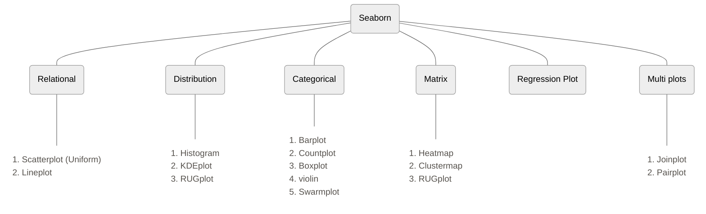

There are two types of functions in seaborn
1. Figure Level
2. Axis Level

The whole image generated by seaborn in divided into objects, the canvas on which the graph is plotted is called figure level, one canvas can contain multiple graphs, those graphs are axis level.
Same graph can be generated using figure level and axis level functions

Graphs are classified as follows:





```python
import seaborn as sns
tips = sns.load_dataset('tips')
```
# 1. Relational Plot

## Scatter plot

```python
# scatter plot -> axes level function

sns.scatterplot(data=tips, x='total_bill', y='tip', hue='sex', style='time', size='size')
```

![[Pasted image 20250622123628.png]]

```python
# relplot -> figure level -> square shape

sns.relplot(data=tips, x='total_bill', y='tip', kind='scatter',hue='sex',style='time',size='size')
```

![[Pasted image 20250622124008.png]]

## Line plot

```python
gap = px.data.gapminder()

temp_df = gap[gap['country'] == 'India']

temp_df
```

```python
# axes level function

sns.lineplot(data=temp_df, x='year', y='lifeExp')
```

```python
# using relpplot

sns.relplot(data=temp_df, x='year', y='lifeExp', kind='line')
```

![[Pasted image 20250622124221.png]]

# 2. Distribution Plots

- Used for univariate analysis
- Used to find out the distribution
- Range of the observation
- Central Tendency
- Is the data bimodal?
- Are there outliers?

## Histplot

```python
# plotting univariate histogram

sns.histplot(data=tips, x='total_bill')
```

![[Pasted image 20250622124951.png]]

```python
# bins parameter

sns.displot(data=tips, x='total_bill', kind='hist',bins=2)
```

![[Pasted image 20250622125011.png]]

```python
# hue parameter

sns.displot(data=tips, x='tip', kind='hist',hue='sex')
```

![[Pasted image 20250622125052.png]]

```python
# element -> step

sns.displot(data=tips, x='tip', kind='hist', hue='sex', element='step')
```

![[Pasted image 20250622125114.png]]

```python
# faceting using col and row -> not work on histplot function

sns.displot(data=tips, x='tip', kind='hist',col='sex',element='step')
```

![[Pasted image 20250622125231.png]]

## KDE plot

Rather than using discrete bins, a KDE plot smooths the observations with a Gaussian kernel, producing a continuous density estimate

```python
sns.kdeplot(data=tips,x='total_bill')
```

![[Pasted image 20250622125340.png]]

```python
# hue -> fill

sns.displot(data=tips,x='total_bill', kind='kde', hue='sex', fill=True, height=10, aspect=2)
```

## RUG plot

- Plot marginal distributions by drawing ticks along the x and y axes.
- This function is intended to complement other plots by showing the location of individual observations in an unobtrusive way.

```python
sns.kdeplot(data=tips,x='total_bill')

sns.rugplot(data=tips,x='total_bill')
```

![[Pasted image 20250622125527.png]]

# Matrix plot

## Heat Map
- Plot rectangular data as a color-encoded matrix

```python
temp_df = gap.pivot(index='country',columns='year',values='lifeExp')

  

# axes level function

plt.figure(figsize=(15,15))

sns.heatmap(temp_df)
```

![[Pasted image 20250622125932.png]]

```python
# annot

temp_df = gap[gap['continent'] == 'Europe'].pivot(index='country',columns='year',values='lifeExp')

  

plt.figure(figsize=(15,15))

sns.heatmap(temp_df,annot=True,linewidth=0.5, cmap='summer')
```

![[Pasted image 20250622130104.png]]![[Pasted image 20250622130158.png]]

![[Pasted image 20250622130741.png]]
