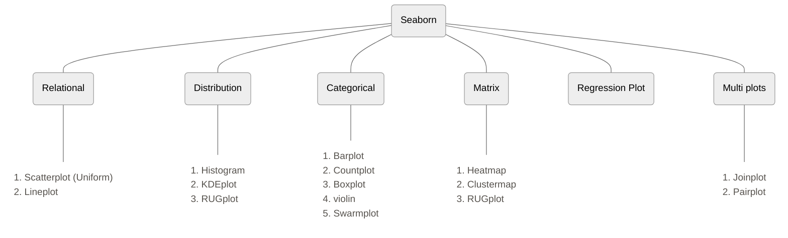

There are two types of functions in seaborn
1. Figure Level
2. Axis Level

The whole image generated by seaborn in divided into objects, the canvas on which the graph is plotted is called figure level, one canvas can contain multiple graphs, those graphs are axis level.
Same graph can be generated using figure level and axis level functions

Graphs are classified as follows:





```python
import seaborn as sns
tips = sns.load_dataset('tips')
```
# Relational Plot


## Scatterplot

```python
# scatter plot -> axes level function

sns.scatterplot(data=tips, x='total_bill', y='tip', hue='sex', style='time', size='size')
```

![[Pasted image 20250622123628.png]]

```python
# relplot -> figure level -> square shape

sns.relplot(data=tips, x='total_bill', y='tip', kind='scatter',hue='sex',style='time',size='size')
```

![[Pasted image 20250622123706.png]]


## Lineplot