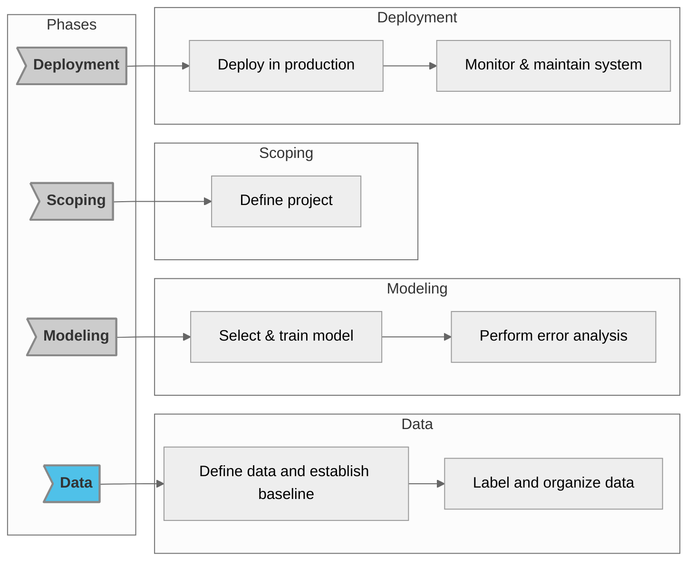

```mermaid
%%{init: {'theme':'neutral','flowchart':{'nodeSpacing':50,'rankSpacing':20}}}%%
flowchart LR

  %% — PHASE BANNERS — 
  subgraph Phases
    direction LR
    A> Scoping    ]:::phase
    B> Data       ]:::phase
    C> Modeling   ]:::phase
    D> Deployment ]:::phase
  end

  %% — STEPS UNDER EACH PHASE — 
  subgraph Scoping
    direction TB
    A1[Define project]
  end

  subgraph Data
    direction TB
    B1[Define data and establish baseline]
    B2[Label and organize data]
  end

  subgraph Modeling
    direction TB
    C1[Select & train model]
    C2[Perform error analysis]
  end

  subgraph Deployment
    direction TB
    D1[Deploy in production]
    D2[Monitor & maintain system]
  end

  %% — CONNECTIONS — 
  A --> A1
  B --> B1 --> B2
  C --> C1 --> C2
  D --> D1 --> D2

  %% — STYLING — 
  classDef phase fill:#cccccc,stroke:#888888,stroke-width:2px,color:#333333,font-weight:bold;
  class A phase
  class B phase
  class C phase
  class D phase

  %% override just the “Data” phase color
  style B fill:#4fc1e9,stroke:#888888,stroke-width:2px;

```
